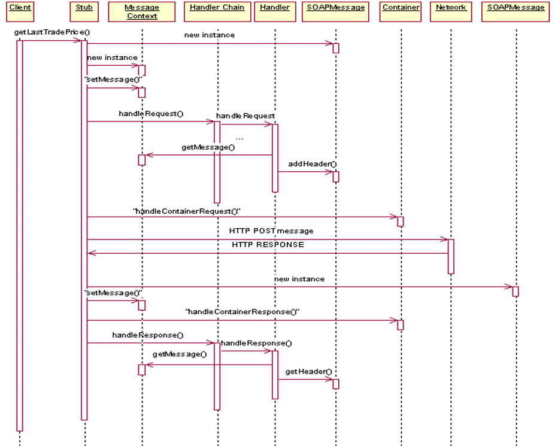

[#anchor-58]
== Handlers

This chapter defines the programming model for handlers in Web Services
for Jakarta EE. Handlers define a means for an application to access the
raw message of a request. This access is provided on both the client and
server. Handlers are not part of the WSDL specification and are
therefore not described in it. See section link:#anchor-39[6.3] for
declaration of handlers within deployment descriptors.  
The Jakarta XML Web Services specification defines the Handler framework.
This specification defines Handler use within a Jakarta EE environment.

=== Concepts

A Handler can be likened to a Servlet Filter in that it is business
logic that can examine and potentially modify a request before it is
processed by a Web Service component. It can also examine and
potentially modify the response after the component has processed the
request. Handlers can also run on the client before the request is sent
to the remote host and after the client receives a response.

Jakarta XML Web Services specification defines Logical Handlers and 
Protocol Handlers.  Logical Handlers are protocol agnostic and are 
unable to affect protocol specific parts of a message. Protocol Handlers 
operate on message context properties and protocol specific messages. 
Protocol handlers are specific to a particular protocol and may access 
and change protocol specific aspects of a message.

Handlers are service specific and therefore associated with a particular
Port component or port of a Service interface. This association is
defined in the deployment descriptors in section link:#anchor-66[7.1]
and link:#anchor-67[7.2] respectively. They are processed in an ordered
fashion called a HandlerChain, which is defined by the deployment
descriptors. Jakarta Web Services Metadata specification defines the 
jakarta.jws.HandlerChain annotation, which can be used with Jakarta XML 
Web Services in the implementation code to declare HandlerChains associated 
with a Port component or a Service.

There are several scenarios for which Handlers may be considered. These
include application specific SOAP header processing, logging, and
caching. A limited form of encryption is also possible. For application
specific SOAP header processing, it is important to note that the client
and server must agree on the header processing semantics without the aid
of a WSDL description that declares the semantic requirements.
Encryption is limited to a literal binding in which the SOAP message
part maps to a SOAPElement. In this case, a value within the SOAPElement
may be encrypted as long as the encryption of that value does not change
the structure of the SOAPElement.

A Handler always runs under the execution context of the application
logic. On the client side, the Stub/proxy controls Handler execution.
Client side Handlers run after the Stub/proxy has marshaled the message,
but before container services and the transport binding occurs. Server
side Handlers run after container services have run including method
level authorization, but before demarshalling and dispatching the
message to the endpoint. Handlers can access the java:comp/env context
for accessing resources and environment entries defined by the Port
component the Handler is associated with.

Handlers are constrained by the Jakarta EE managed environment. Handlers
are not able to re-target a request to a different component. Handlers
cannot change the WSDL operation nor can Handlers change the message
part types and number of parts. On the server, Handlers can only
communicate with the business logic of the component using the
MessageContext. On the client, Handlers have no means of communicating
with the business logic of the client. There is no standard means for a
Handler to access the security identity associated with a request,
therefore Handlers cannot portably perform processing based on security
identity.

The life cycle of a Handler is controlled by the container.

Handlers are associated with the Port component on the server and
therefore run in both the web and EJB containers.

Jakarta EE applications that define one or more port components or 
service references include WSDL descriptions for each of them as well as
application logic and (optionally) message handlers associated with
them. In order for such applications to behave predictably, all three
elements (description, handlers and application logic) must be well
aligned. Developers should program handlers carefully in order not to
create invalid SOAP envelope format that contradicts WS-I BP 1.0
requirements or violates the message schema declared in the WSDL. In
particular, containers cannot provide any guarantees beyond those
specified as part of the interoperability requirements on the behavior
of an application that violates the assumptions embedded in a WSDL
document either in its business logic or in message handlers.

=== Specification

This section defines the requirements for Jakarta XML Web Services Handlers 
running Jakarta Enterprise Web Services. Differences between this specification 
and the Jakarta XML Web Services specification are noted in boxed paragraphs.

==== Scenarios

Handlers must be able to support the following scenarios:

Scenario 1: Handlers must be able to transform the SOAP header. One
example is the addition of a SOAP header for application specific
information, like customerId, by the handler.

Scenario 2: Handlers must be able to transform just parts of the body.
This might include changing part values within the SOAP body. Encryption
of some parameter values is an example of this scenario.

Scenario 3: Handlers must be able to just read a message where no
additions, transformations, or modification to the message is made.
Common scenarios are logging, metering, and accounting.

==== Programming Model

A Web Services for Jakarta EE provider is required to provide all
interfaces and classes of the jakarta.xml.ws.handler package. 

A Jakarta XML Web Services for Jakarta EE provider is required to provide an
implementation of HandlerResolver that returns the Handler Chain with
Handlers specified in the deployment descriptor or the
jakarta.jws.HandlerChain annotation. The ordering of the Handlers in the
HandlerChain must follow the requirements specified in Jakarta XML Web Services
specification section 9.2.1.2. In addition to this, the ordering of any given 
type of Handler (logical or protocol) in the deployment descriptor must be maintained.

A Web Services for Jakarta EE provider is required to provide an
implementation of MessageContext.

A Web Services for Jakarta EE provider is required to provide all the
interfaces of the jakarta.xml.ws.handler.soap package. The provider must 
also provide an implementation of the SOAPMessageContext interface.

The programming model of a Port component can be single-threaded or
multi-threaded as defined in sections link:#anchor-43[5.3.2.3] and
link:#anchor-44[5.3.2.4]. The concurrency of a Jakarta XML Web Services 
Handler must match the concurrency of the business logic it is associated 
with.  Client handlers may need to support multi-threaded execution 
depending on the business logic which is accessing the Port.

Handlers must be loaded using the same class loader the application code
was loaded with. The class loading rules follow the rules defined for
the container the Handler is running in.

In a product that also supports Jakarta Contexts and Dependency Injection, 
an implementation must support use of CDI-style managed beans as Jakarta 
XML Web Services handler classes in an application. Jakarta Contexts and 
Dependency Injection specifies the requirements for these container-managed 
bean instances w.r.t instantiation, injection and other services. 
Jakarta Contexts and Dependency Injection specification defines @Dependent pseudo-scope, 
handler classes must be specified in that scope. It is an error if the 
handler class has a scope other than the required one.

In a product that also supports Jakarta Managed Beans, an implementation must
support use of managed beans as Jakarta XML Web Services handler classes in an
application. Jakarta Managed Beans specification specifies the requirements for
these container-managed bean instances w.r.t instantiation, injection
and other services.

===== Handler Life Cycle with Jakarta XML Web Services

The Jakarta XML Web Services based container manages the lifecycle of handlers 
by invoking any methods of the handler class annotated as lifecycle methods 
before and after dispatching requests to the handler itself.

The lifecycle of a handler instance begins when the container creates a new instance 
of the handler class.

* The handler instance is initialized by invoking the lifecycle method annotated with 
jakarta.annotation.PostConstruct (defined by Jakarta Annotations specification).
This method is only called after all injections requested by the Handler are completed.
Once the handler instance is created and initialized it is placed into the Ready state. 
While in the Ready state the Jakarta XML Web Services runtime may invoke other handler 
methods as required.

* The lifecycle of a handler instance ends when the container stops using the handler 
for processing inbound or outbound messages and invokes the lifecycle method annotated
with jakarta.annotation.PreDestroy.

The lifecycle methods annotated with jakarta.annotation.PostConstruct and
jakarta.annotation.PreDestroy in the Handler implementation allows the
container to notify a Handler instance of impending changes in its
state. Detailed requirements for Handler lifecycle are described in
section 9.3.1 of Jakarta XML Web Services specification. The Handler may 
use the notification to prepare its internal state for the transition. 
The container is required to call lifecycle methods annotated with 
jakarta.annotation.PostConstruct and jakarta.annotation.PreDestroy as 
described below.

The container must carry out any injections (if any) requested by the
handler, typically via the @Resource annotation (see Jakarta Annotations specification).
After all the injections have been carried out, the container must invoke the
method carrying a jakarta.annotation.PostConstruct annotation. This method
must have a void return type and take zero arguments. The handler
instance is then ready for use and other handler methods may be invoked.

The container must call the lifecycle method annotated with
jakarta.annotation.PreDestroy annotation on any Handler instances which it
instantiated, before releasing a handler instance from its working set.
A container must not call this method while a request is being processed
by the Handler instance. The container must not dispatch additional
requests to the Handler after the this method is called.

The requirements for processing any RuntimeException or ProtocolException 
thrown from handle<action>() method of the handler are defined in 
sections 9.3.2.1 and 9.3.2.2 of the Jakarta XML Web Services specification.

Pooling of Handler instances is allowed, but is not required. If Handler
instances are pooled, they must be pooled by Port component. This is
because Handlers may retain non-client specific state across method
calls that are specific to the Port component. For instance, a Handler
may initialize internal data members with Port component specific
environment values. These values may not be consistent when a single
Handler type is associated with multiple Port components. Any pooled
instance of a Port component's Handler in a Method Ready state may be
used to service handle<action>() methods in a Jakarta XML Web Services 
based container. It is not required that the same Handler instance service 
handleMessage() or handleFault() method invocation of any given request 
in the Jakarta XML Web Services based container.

===== jakarta.jws.HandlerChain annotation

The jakarta.jws.HandlerChain annotation from Jakarta Web Services Metadata specification 
(imported by Jakarta XML Web Services) may be declared on Web Service endpoints 
(those declared with the jakarta.jws.WebService or jakarta.xml.ws.WebServiceProvider annotation) 
or on Web Service references (those declared with the jakarta.xml.ws.WebServiceRef annotation). 
This annotation is used to specify the handler chain to be applied on the declared port component
or Service reference. Details on the jakarta.jws.HandlerChain annotation can be found in 
section 4.6 of Jakarta Web Services Metadata specification. If this annotation is used, 
the handler chain file for this must be packaged with the application unit according to the 
packaging rules in Section link:#anchor-39[6.3].

The deployment descriptors on port component or Service reference
override the jakarta.jws.HandlerChain annotation specified in the
implementation.

The <handler-chains> element in the deployment descriptor is used for
specifying the handlers on a port component or Service reference. This
deployment descriptor allows for specifying multiple handler chains such
that all handlers in a handler chain could be specific to a Service
name, a Port name or a list of protocol bindings. Patterns on Service
names and Port names are also allowed, where in the handlers in a
handler chain could be specific to a Service name pattern or Port name
pattern. Refer to Chapter link:#anchor-65[7] for details on the deployment schema 
for handlers.

Jakarta XML Web Services based container provider is required to support 
this annotation.  They are also required to provide an implementation of 
HandlerResolver that returns a handler chain with handlers specified in 
the deployment descriptor or the jakarta.jws.HandlerChain annotation. 
The ordering of the handlers in the handler chain must follow the requirements 
specified in section 9.2.1.2 of Jakarta XML Web Services specification.  
In addition to this, the ordering of any given type of Handler 
(logical or protocol) in the deployment descriptor must be maintained.

===== Security

Handlers associated with a Port component run after authorization has
occurred and before the business logic method of the Service
Implementation bean is dispatched to. For Jakarta XML Web Services 
Service endpoints, Handlers run after the container has performed the security
constraint checks associated with the servlet element that defines the
Port component. For EJB based service implementations, Handlers run
after method level authorization has occurred.

A Handler must not change the message in any way that would cause the
previously executed authorization check to execute differently.

A handler may perform programmatic authorization checks if the
authorization is based solely on the MessageContext and the component’s
environment values. A Handler cannot perform role based programmatic
authorization checks nor can a Handler access the Principal associated
with the request.

The Java security permissions of a Handler follow the permissions
defined by the container it runs in. The application client, web, and
EJB containers may have different permissions associated with them. If
the provider allows defining permissions on a per application basis,
permissions granted to a Handler are defined by the permissions granted
to the application code it is packaged with. See section EE.6.2.3 of the
Jakarta EE specification for more details.

[#anchor-69]
===== Transactions

Handlers run under the transaction context of the component they are
associated with.

Handlers must not demarcate transactions using the
jakarta.transaction.UserTransaction interface.

==== Developer Responsibilities

A developer is not required to implement a Handler. Handlers are another
means of writing business logic associated with processing a Web
services request. A developer may implement zero or more Handlers that
are associated with a Port component and/or a Service reference. If a
developer implements a Handler, they must follow the requirements
outlined in this section.

A Handler is implemented as a stateless instance. A Handler does not
maintain any message processing (client specific) related state in its
instance variables across multiple invocations of the handle method.

A Handler class must implement the jakarta.xml.ws.handler.Handler interface 
or one of its subinterfaces.

With Jakarta XML Web Services, the handler allows for resources to be injected, 
typically by using the @Resource annotation. So a Handler.handle<action>() method
may access the component's context and environment entries by using any
resources that were injected. It can also use JNDI lookup of the
"java:comp/env" context and accessing the env-entry-names defined in the
deployment descriptor by performing a JNDI lookup. See chapter 15 of the
Jakarta Enterprise Beans specification - _Jakarta Enterprise Beans Core
Contracts and Requirements_ for details. The container may throw a
java.lang.IllegalStateException if the environment is accessed from any
other Handler method and the environment is not available. The element
init-params in the deployment descriptors is no longer used for Jakarta XML 
Web Services based container. If needed, the developer should use the environment
entry elements (<env-entry>) declared in the application component's
deployment descriptor for this purpose. These can be injected into the
handler using the @Resource annotation or looked up using JNDI.

A Handler implementation that implements the jakarta.xml.ws.handler.soap.SOAPHandler 
interface must contain all the headers information needed by it.  Additionally, 
in this case the soap-header element declared in the deployment descriptor is 
not required since that information is embedded in the implementation of the Handler class.

Only a Handler implementation that implements the jakarta.xml.ws.handler.soap.SOAPHandler 
interface must implement the getHeaders() method. The headers that a Handler declares it 
will process (i.e. those returned by the Handler.getHeaders() method) must be defined
in the WSDL definition of the service.

A Handler implementation should test the type of the MessageContext passed to the Handler 
in the handle<action>() methods. Although this specification only requires support for 
SOAP messages and the container will pass a SOAPMessageContext in this case, some providers 
may provide extensions that allow other message types and MessageContext types to be
used. A Handler implementation should be ready to accept and ignore message types which 
it does not understand.

A Handler implementation must use the MessageContext to pass information
to other Handler implementations in the same Handler chain and, in the
case of Jakarta XML Web Services service endpoint, to the Service
Implementation Bean. A container is not required to use the same thread
for invoking each Handler or for invoking the Service Implementation
Bean.

A Handler may access the env-entrys of the component it is associated with 
by using JNDI to lookup an appropriate subcontext of java:comp/env. It may 
also access these if they are injected using the @Resource annotation. 
Access to the java:comp/env contexts must be supported from the method 
annotated with jakarta.annotation.PostConstruct and handle<action>() methods. 
Access may not be supported within the method annotated with 
jakarta.annotation.PreDestroy annotation.

A Handler may access transactional resources defined by a component's
resource-refs. Resources are accessed under a transaction context
according to section link:#anchor-69[6.2.2.5].

A Handler may access the complete SOAP message and can process both SOAP
header blocks and body if the handle<action>() method is passed a
SOAPMessageContext.

A SOAPMessageContext Handler may add or remove headers from the SOAP
message. A SOAPMessageContext Handler may modify the header of a SOAP
message if it is not mapped to a parameter or if the modification does
not change value type of the parameter if it is mapped to a parameter. A
Handler may modify part values of a message if the modification does not
change the value type.

Handlers that define application specific headers should declare the
header schema in the WSDL document for the component they are associated
with, but are not required to do so.

==== Container Provider Responsibilities

In a Jakarta XML Web Services based container, a Handler chain is processed 
according to the Jakarta XML Web Services specification section 9.2.1.2.
In addition to this, the ordering of any given type of Handler (logical or protocol) 
in the deployment descriptor or in the handler configuration file specified in the 
jakarta.jws.HandlerChain annotation, must be maintained.

The container must ensure that for EJB based Web Service endpoints with
both Handlers and EJB Interceptors present, the Handlers must be invoked
before any EJB business method interceptor methods.

A Jakarta XML Web Services based container must carry out any injections (if any)
requested by the handler, typically via the @Resource annotation (see
section 2.2 of Jakarta Annotations specification).  A Jakarta XML Web Services handler should 
use the jakarta.xml.ws.WebServiceContext, which is an injectable resource, to
access message context and security information relative to the request
being served. A unique Handler instance must be provided for each Port
component declared in the deployment descriptor or annotated by
jakarta.jws.WebService or jakarta.xml.ws.WebServiceProvider annotations.

The container provider must ensure that for a Jakarta XML Web Services 
based EJB endpoint executing in the EJB container, with both Handlers 
and EJB Interceptors present, the java.util.Map<String,Object> instance 
returned by invoking WebServiceContext.getMessageContext() method in the 
Jakarta XML Web Services Handler, is the same Map instance that is obtained 
by invoking InvocationContext.getContextData() in the EJB Interceptor. 
This common Map instance would allow for sharing of data (if required) 
between the Handlers and Interceptors.

A Jakarta XML Web Services based container must call the lifecycle method 
annotated with jakarta.annotation.PostConstruct within the context of a 
Port component's environment. The container must ensure the Port component's 
env-entrys are setup for this lifecycle method to access.

The container must provide a MessageContext type unique to the request
type. For example, the container must provide a SOAPMessageContext to
the handle<action>() methods of a Jakarta XML Web Services SOAPHandler 
in a handler chain when processing a SOAP request. The SOAPMessageContext 
must contain the complete SOAP message.

The container must share the same MessageContext instance across all
Handler instances and the target endpoint that are invoked during a
single request and response or fault processing on a specific node.

The container must setup the Port component's execution environment
before invoking the handle<action>() methods of a handler chain.
Handlers run under the same execution environment as the Port
component's business methods. This is required so that handlers have
access to the Port component's java:comp/env context.

[#anchor-39]
=== Packaging

A developer is required to package, either by containment or reference,
the Handler class and its dependent classes in the module with the
deployment descriptor information that references the Handler classes. A
developer is responsible for defining the handler chain information in
the deployment descriptor.

The handler chain file in the jakarta.jws.HandlerChain annotation is
required to be packaged in the module. It must follow the requirements
for location as specified in Jakarta Web Services Metadata specification.
Additionally, the handler chain file can also be packaged and specified 
in the annotation such that, it is accessible as a resource from the 
ClassPath. At runtime, container providers must first try to access the 
handler chain file as per the locations specified in Jakarta Web Services 
Metadata specification specification. Failing that, they must try to 
access it as a resource from the ClassPath. If more than one resources 
are returned from the ClassPath, then the first one is used.

=== Object Interaction Diagrams

This section contains object interaction diagrams for handler
processing. In general, the interaction diagrams are meant to be
illustrative.

==== Client Web service method access

* Figure 8 Client method invoke handler OID

==== EJB Web service method invocation

image:images/9.png[image,width=517,height=345]

* Figure 9 EJB Web service method invocation handler processing part 1

image:images/10.png[image,width=504,height=174]

* Figure 10 EJB Web service method invocation handler processing part 2
