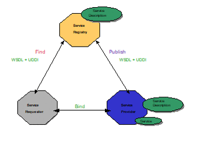
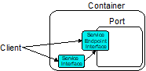
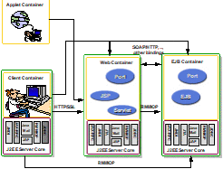
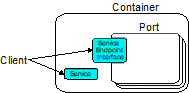

== Overview

This chapter provides an overview of Web services in general and how Web
Services for Jakarta EE fits into the Jakarta EE platform.

=== Web Services Architecture Overview

Web services is a service oriented architecture which allows for
creating an abstract definition of a service, providing a concrete
implementation of a service, publishing and finding a service, service
instance selection, and interoperable service use. In general a Web
service implementation and client use may be decoupled in a variety of
ways. Client and server implementations can be decoupled in programming
model. Concrete implementations may be decoupled in logic and transport.

* Figure 1 Service oriented architecture

The service provider defines an abstract service description using the
Web Services Description Language (WSDL). A concrete Service is then
created from the abstract service description yielding a concrete
service description in WSDL. The concrete service description can then
be published to a registry such as Universal Description, Discovery and
Integration (UDDI). A service requestor can use a registry to locate a
service description and from that service description select and use a
concrete implementation of the service.

The abstract service description is defined in a WSDL document as a
PortType. A concrete Service instance is defined by the combination of a
PortType, transport & encoding binding and an address as a WSDL port.
Sets of ports are aggregated into a WSDL service.

[#anchor-4]
=== Web Service

There is no commonly accepted definition for a _Web service._ For the
purposes of this specification, a Web service is defined as a component
with the following characteristics:

* A service implementation implements the methods of an interface that
is describable by WSDL. The methods are implemented using a
Stateless/Singleton Session EJB or Jakarta XML Web Services web component.
* A Web service may have its interface published in one or more
registries for Web services during deployment.
* A Web Service implementation, which uses only the functionality
described by this specification, can be deployed in any Web Services for
Jakarta EE compliant application server.
* A service instance, called a Port, is created and managed by a
container.
* Run-time service requirements, such as security attributes, are
separate from the service implementation. Tools can define these
requirements during assembly or deployment.
* A container mediates access to the service.

Jakarta XML Web Services defines a programming model mapping of a WSDL document
to Java which provides a factory (Service) for selecting which
aggregated Port a client wishes to use. See <<figure2,Figure 2>> for
a logical diagram. In general, the transport, encoding, and address of
the Port are transparent to the client. The client only needs to make
method calls on the Service Endpoint Interface, as defined by
Jakarta XML Web Services, (i.e. PortType) to access the service. See
<<ClientProgrammingModel.adoc#anchor-13, Chapter 4>> for more details.

[#figure2]

* Figure 2 Client view

=== Web Services for Jakarta EE Overview

The Web Services for Jakarta EE specification defines the required
architectural relationships as shown in <<figure3,Figure 3>>. This
is a logical relationship and does not impose any requirements on a
container provider for structuring containers and processes. The
additions to the Jakarta EE platform include a port component that depends
on container functionality provided by the web and EJB containers, and
the SOAP/HTTP transport.

//TODO: image images/3.png mentions J2EE - should be replaced with Jakarta EE?
[#figure3]

* Figure 3 Jakarta EE architecture diagram

Web Services for Jakarta EE requires that a Port be referencable from the
client, web, and EJB containers. This specification does not require
that a Port be accessible from the applet container.

This specification adds additional artifacts to those defined by
Jakarta XML Web Services that may be used to implement Web services, a role
based development methodology, portable packaging and Jakarta EE container
services to the Web services architecture. These are described in later
sections.

==== Web Service Components

This specification defines two means for implementing a Web service,
which runs in a Jakarta EE environment, but does not restrict Web service
implementations to just those means. The first is a container based
extension of the Jakarta XML Web Services programming model which defines a Web
service as a Java class running in the web container. The second uses a
constrained implementation of a stateless session EJB or singleton
session EJB in the EJB container.
Other service implementations are possible, but are not defined by this
specification.

==== Web Service Containers

The container provides for life cycle management of the service
implementation, concurrency management of method invocations, and
security services. A container provides the services specific to
supporting Web services in a Jakarta EE environment. This specification
does not require that a new container be implemented. Existing Jakarta EE
containers may be used and indeed are expected to be used to host Web
services. Web service instance life cycle and concurrency management is
dependent on which container the service implementation runs in. A
Jakarta XML Web Services Service Endpoint implementation in a web container
follows standard servlet life cycle and concurrency requirements and an
EJB implementation in an EJB container follows standard EJB life cycle
and concurrency requirements.

=== Platform Roles

This specification defines the responsibilities of the existing Jakarta 
EE platform roles. There are no new roles defined by this specification.
There are two roles specific to Web Services for Jakarta EE used within
this specification, but they can be mapped onto existing Jakarta EE
platform roles. The Web Services for Jakarta EE product provider role can
be mapped to a Jakarta EE product provider role and the Web services
container provider role can be mapped to a container provider role
within the Jakarta EE specification.

In general, the developer role is responsible for the service
definition, implementation, and packaging within a Jakarta EE module. The
assembler role is responsible for assembling the module into an
application, and the deployer role is responsible for publishing the
deployed services and resolving client references to services. More
details on role responsibilities can be found in later sections.

=== Portability

A standard packaging format, declarative deployment model, and standard
run-time services provide portability of applications developed using
Web services. A Web services specific deployment descriptor included in
a standard Jakarta EE module defines the Web service use of that module.
More details on Web services deployment descriptors can be found in
later chapters. Deployment tools supporting Web Services for Jakarta EE are
required to be able to deploy applications packaged according to this
specification.

Web services container providers may provide support for additional
service implementations and additional transport and encoding bindings
at the possible expense of application portability.

=== Standard Services

The Jakarta EE platform defines a set of standard services a Jakarta EE
provider must supply. The Web Services for Jakarta EE specification
identifies an additional set of run-time services that are required.

==== Jakarta XML Web Services

Jakarta XML Web Services is based on the JAX-WS specification from the
Java EE specification. This document refers to version 3.0 of the 
Jakarta XML Web Services specification and APIs unless explicitly 
noted otherwise.

JAX-WS 2.0 is a follow-on specification to JAX-RPC 1.1. In addition to
providing all the run-time services, it improves upon JAX-RPC 1.1
specification by providing support for SOAP 1.2, using JAXB 2.0
specification for all data binding-related tasks, providing support for
Web Services metadata etc .

JAX-WS 2.2 adds a complete Web Services addressing support as specified
in Web Services Addressing 1.0 - Core, Web Services Addressing 1.0 -
Soap Binding, and Web Services Addressing 1.0 - Metadata.

Jakarta XML Web Services 3.0 is a next version of the JAX-WS 2.2
specification. It moves existing APIs from javax.xml.ws packages to
jakarta.xml.ws packages.

=== Interoperability

This specification extends the interoperability requirements of the Jakarta
EE platform by defining interoperability requirements for products that
implement this specification on top of Jakarta EE. The interoperability
requirements rely on the interoperability of existing standards that
this specification depends on.

The specification builds on the evolving work of the following JSRs and
specifications:

* Jakarta XML-RPC
* Jakarta XML Web Services
* Jakarta Enterprise Edition Specification
* Jakarta Enterprise Beans Specification
* Jakarta Servlet Specification
* WS-I Basic Profile 1.0

=== Scope

The following sections define the scope of what is and what is not
covered by this specification.

==== Scope

* The scope of this specification is limited to Web service standards
that are widely documented and accepted in the industry. These include:

** SOAP 1.1, SOAP 1.2 and SOAP with Attachments
** WSDL 1.1
** UDDI 1.0

* This specification is limited to defining support for SOAP over HTTP
1.1 or HTTPS protocols and communication APIs for Web services (vendors
are free to support additional transports).
* These standards are expected to continue to change and evolve. Future
versions of this specification will accommodate and address future
versions of these standards. In this specification, all references to
SOAP, WSDL, and UDDI are assumed to be the versions defined above.

==== Not in Scope

* The most glaring deficiency of SOAP over HTTP is basic reliable
message semantics. Despite this deficiency, this specification does not
consider Message Reliability or Message Integrity to be in scope. Other JSRs,
like the evolution and convergence of JAX-M and JMS, as well as
activities in W3C and other standard bodies will define these
capabilities.
* Persistence of XML data.
* Workflow and data flow models.
* Arbitrary XML transformation.
* Client programming model for Web service clients that do not conform
to this specification.

=== Web Service Client View

The client view of a Web service is quite similar to the client view of
a Jakarta Enterprise Bean. A client of a Web service can be another Web
service, a Jakarta EE component, including a Jakarta EE application client, or
an arbitrary Java application. A non-Java application or non-Web
Services for Jakarta EE application can also be a client of Web service,
but the client view for such applications is out of scope of this
specification.

The Web service client view is remotable and provides local-remote
transparency.

The Port provider and container together provide the client view of a
Web service. This includes the following:

* Service interface or class
* Service Endpoint interface

The Jakarta XML Web Services Handler interface is considered a container SPI
and is therefore not part of the client view.

Figure 4 Web Service Client View

The Service Interface/Class defines the methods a client may use to
access a Port of a Web service. A client does not create or remove a
Port. It uses the Service Interface/Class to obtain access to a Port.
The Service interface/class is defined by the Jakarta XML Web Services
specification, but its behavior is defined by a WSDL document supplied
by the Web service provider. The container’s deployment tools provide an
implementation of the methods of the Service Interface/Class or the
Jakarta XML Web Services Generated Service Interface.

A client locates a Service Interface by using JNDI APIs. This is
explained further in <<ClientProgrammingModel.adoc#anchor-13, Chapter 4>>.

A Web service implementation is accessed by the client using the Service
Endpoint Interface. The Service Endpoint Interface is specified by the
service provider. The deployment tools and container run-time provide
server side classes which dispatch a SOAP request to a Web service
implementation which implements the methods of the Service Endpoint
Interface.

A Port has no identity within the client view and is considered a
stateless object.

===  Web Service Server View

<<ServerProgrammingModel.adoc#anchor-10, Chapter 5>>
defines the details of the server programming model. This section
defines the general requirements for the service provider.

The service provider defines the WSDL PortType, WSDL binding, and
Service Endpoint Interface of a Web service. The PortType and Service
Endpoint Interface must follow the Jakarta XML Web Services rules for
WSDL->Java and Java->WSDL mapping.

The service provider defines the WSDL service and aggregation of ports
in the WSDL document.

The business logic of a Web service is implemented by a service provider
in one of two different ways:

[arabic]
. A Stateless Session Bean: The service provider implements the Web
service business logic by creating a stateless session Bean that
implements the methods of the Service Endpoint Interface as described in
the Jakarta Enterprise Beans specification.
. A Java class: The service provider implements the Web service business
logic according to the requirements defined by the Jakarta XML Web Services
Servlet based service implementation model.
. A Singleton Session Bean: The service provider implements the Jakarta XML
Web Services Web service business logic by creating a singleton session bean
that implements the methods of the Service Endpoint Interface as described in
the Jakarta Enterprise Bean specification.

The life cycle management of a Web service is specific to the service
implementation methodology.

The service provider implements the container callback methods specific
to the service implementation methodology used. See the Jakarta XML Web
Services specification and Jakarta Enterprise Beans specification for details
on the container callback methods.

The container manages the run-time services required by the Web service,
such as security. The default behavior requires that if a client
accesses a Port with a transaction context, it will be suspended before
the Port is accessed. This ensures that remote and local invocations
using a SOAP/HTTP binding do not behave differently. Vendors may support
transaction propagation (e.g. using WS-AtomicTransaction) as long as the
transactional behavior is consistent for local and remote invocations.

Service providers must avoid programming practices that interfere with
container operation. These restrictions are defined by the Jakarta EE,
Servlet, and EJB specifications.

Packaging of a Web service in a Jakarta EE module is specific to the
service implementation methodology, but follows the Jakarta EE requirements
for an EJB-JAR file or WAR file. It contains the Jakarta class files of the
Service Endpoint Interface and WSDL documents for the Web service. In
addition it contains an XML deployment descriptor which defines the Web
service Ports and their structure. Packaging requirements are described
in <<ServerProgrammingModel.adoc#anchor-51, Section 5.4>>.

=== Jakarta EE profiles

The Jakarta EE platform specification defines "profiles" to target
specific class of applications.

The Jakarta EE 9 platform removes Jakarta XML-RPC from all profiles, and it
includes Jakarta XML Web Services in the full profile.

This specification gives choices for the vendors that want to support
only certain containers for Jakarta XML Web Services web services. An
Enterprise Web Service implementation must support at least one of the
following configurations for Jakarta XML Web Services web services:

* Jakarta XML Web Services web component in a Servlet container
* Stateless or Singleton Session EJB as Jakarta XML Web Services web service
