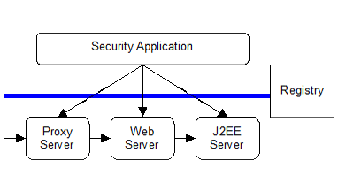

== Security

This section defines the security requirements for Web Services for Jakarta EE. 
A conceptual overview of security and how it applies to Web services is covered 
in the <<#anchor-78, Concepts>> section. The <<#anchor-79, Goals>> section defines 
what this specification attempts to address and the <<#anchor-80, Specification>> section 
covers the requirements.

[#anchor-78]
=== Concepts

The Web services security challenge is to understand and assess the risk
involved in securing a web based service today and at the same time to
track emerging standards and understand how they will be deployed to
offset the risk in the future. Any security model must illustrate how
data can flow through an application and network topology to meet the
requirements defined by the business without exposing the data to undue
risk. A Web services security model should support protocol independent
declarative security policies that Web Service for Jakarta EE providers can
enforce, and descriptive security policies attached to the service
definitions that clients can use in order to securely access the
service.

The five security requirements that need to be addressed to assure the
safety of information exchange are:

* *Authentication* - the verification of the claimant's entitlements to
use the claimed identity and/or privilege set.
* *Authorization* - the granting of authority to an identity to perform
certain actions on resources
* *Integrity* - the assurance that the message was not modified
accidentally or deliberately in transit.
* *Confidentiality* - the guarantee that the contents of the message are
not disclosed to unauthorized individuals.
* *Non-repudiation* - the guarantee that the sender of the message
cannot deny that the sender has sent it. This request also implies
message origin authentication.

The risks associated with these requirements can be avoided with a
combination of various existing and emerging technologies and standards
in Jakarta EE environments. There are fundamental business reasons
underlying the existence of various security mechanisms to mitigate the
various security risks outlined above. The authentication of the entity
is necessary. This helps provide access based on the identity of the
caller of the Web service. The business reason for data integrity is so
that each party in a transaction can have confidence in the business
transaction. It's also a business-legal issue to have an audit trail and
some evidence of non-repudiation to address liability issues. And more
and more businesses are becoming aware of the internal threats to their
applications by employees or others inside the firewall. Some business
transactions require that confidentiality be provided on a service
invocation or its data (like credit card numbers). There is also the
need for businesses on the Internet to protect themselves from denial of
service attacks being mounted. This is the environment in which we need
to assert a security service model.

==== Authentication

Since the Web services architecture builds on existing component
technologies, intra-enterprise authentication is no different than
today's approaches. In order for two or more parties to communicate
securely they may need to exchange security credentials. Web service's
security is used to exchange many different types of credentials. A
credential represents the authenticity of the identity it is associated
with e.g., Kerberos ticket. A credential can be validated to verify the
authenticity and the identity can then be inferred from the credential.

When two parties communicate, it is also important for the sender to
understand the security requirements of the target service. This helps
the sender to provide necessary credentials along with the request.
Alternatively, the target may challenge the sender for necessary
credential (similar to how HTTP servers challenge the HTTP clients).

In the future, it is expected that message level security mechanisms
will be supported. Using that approach, credentials can be propagated
along with a message and independent of the underlying transport
protocols. Similarly, confidentiality and integrity of a message can be
ensured using message level protection. Message level security support
would help address end-to-end security requirements so that requests can
traverse through multiple network layers, topologies and intermediaries
in a secure fashion independent of the underlying protocol.

In the future, it is also anticipated that in order for client
applications to determine the level of security expected by a Web
service and the expected type of credential, the information about the
authentication policy will be included in or available through the
service definition (WSDL). Based on that service definition, a client
provides appropriate credentials. If the container has policies for the
service, then they must be referenced and used.

* Figure 11 security flow overview

Consider a scenario where incoming SOAP/WSDL messages flow over HTTP(S).
The figure above provides a simple overview of the security flow.
Enterprise Web sites rely on the Jakarta EE Server support for the
authentication models. The site also relies on a Proxy Server's support
for security. In these scenarios, authentication occurs before the Jakarta
EE Server receives the request. In these cases, a Proxy Server or Web
Server forwards authentication credentials into the Jakarta EE Application
Server. The Jakarta EE application server handles the request similar to
how it handles other HTTP requests.

Two forms of authentication are available for use within Web Services
for Jakarta EE based on existing Jakarta EE functionality. These are HTTP
BASIC-AUTH and Symmetric HTTP, which are defined by the Jakarta Servlet
specification.

Using the authentication models above, the container can also perform a
credential mapping of incoming credentials at any point along the
execution path. The mapping converts the external user credentials into
a credential used within a specific security domain, for example by
using Kerberos or other embedded third party model.

In addition to Jakarta EE security model for credential propagation, it may
be beneficial to carry identity information within SOAP message itself
(e.g., as a SOAP header). This can help address situations where Web
services need to be supported where inherent security support of
underlying transport and protocols may not be sufficient (e.g., JMS).
Jakarta Enterprise Web Services specification does not require any 
support for credential propagation within SOAP messages and considers 
this functionality as future work.

==== Authorization

In an enterprise security model, each application server and middleware
element performs authorization for its resources (EJBs, Servlets,
Queues, Tables, etc.). The Jakarta EE authentication/delegation model
ensures that the user identity is available when requests are processed.

On successful authentication, identity of the authenticated user is
associated with the request. Based on the identity of the user,
authorization decisions are made. This is performed by the Jakarta EE
Servers based on the Jakarta EE security model to only allow authorized
access to the methods of EJBs and Servlets/JSPs. Authorization to Web
services implemented as Jakarta XML Web Services Service Endpoints will be
based on the servlet/JSP security model.

==== Integrity and Confidentiality

In general, integrity and confidentiality are based on existing Jakarta EE
support such as HTTPS.

Message senders may also want to ensure that a message or parts of a
message remain confidential and that it is not modified during transit.
When a message requires confidentiality, the sender of the message may
encrypt those portions of the message that are to be kept private using
XML Encryption. When the integrity of a message is required to be
guaranteed, the sender of the message may use XML Digital Signature to
ensure that the message is not modified during transit. This
specification recommends that Jakarta EE servers use XML Encryption for
confidentiality, and XML Digital Signature for integrity but defers to
future work to standardize the format and APIs.

==== Audit

Jakarta EE Servers can optionally write implicit and explicit audit records
when processing requests. The middleware flows the user credentials and
a correlation ID in an implicit context on all operations. Management
tools can gather the multiple logs, merge them and use the correlation
information to see all records emitted processing an incoming Web
service request. It is recommended that Jakarta EE servers implement
support for audit records, but defers to the Jakarta EE to standardize the
record formats and APIs to support audit logs.

==== Non-Repudiation

The combination of Basic Authentication over HTTP/S is widely used in
the industry today to ensure confidentiality, authentication and
integrity. However, it fails to assure non-repudiation.

It is recommended that Jakarta EE servers implement support for
non-repudiation logging, but does not define a standard mechanism to
define and support it.

[#anchor-79]
=== Goals

The security model for Web services in Jakarta EE application servers
should be simple to design and use, ubiquitous, cost effective, based on
open standards, extensible, and flexible. The base functionality needs
to be able to be used for the construction of a wide variety of security
models, security authentication credentials, multiple trust domains and
multiple encryption technologies. Therefore, the goals for security
include the following:

* Should support protecting Web services using Jakarta EE authorization
model.
* Should support propagating authentication information over the
protocol binding through which a Web service request is submitted.
* Should support transport level security to ensure confidentiality and
integrity of a message request.
* Should be firewall friendly; be able to traverse firewalls without
requiring the invention of special protocols.

==== Assumptions

The following assumptions apply to this chapter:

The server relies on the security infrastructure of the Jakarta EE
Application Server.

The Quality of Service (QoS) of a secure Web service container is based
on the QoS requirements and functionality of the underlying Jakarta EE
application server itself (e.g., integrity).

The server relies on HTTPS for hop-by-hop confidentiality and integrity .

[#anchor-80]
=== Specification

The following sections define the requirements for implementing security
for Web Services for Jakarta EE.

==== Authentication

There are few authentication models to authenticate message senders that
are adopted or proposed as standards. Form based login requires html
processing capability so it is not included in this list. Web Services
for Jakarta EE product providers must support the following:

* BASIC-AUTH: Jakarta EE servers support basic auth information in the HTTP
header that carries the SOAP request. The Jakarta EE server must be able to
verify the user ID and password using the authentication mechanism
specific to the server. Typically, user ID and password are
authenticated against a user registry. To ensure confidentiality of the
password information, the user ID and password are sent over an SSL
connection (i.e., HTTPS). See the Servlet specification for details on
how BASIC-AUTH must be supported by Jakarta EE servers and how a HTTP
Digest authentication can be optionally supported. Client container
specification of authentication data is described by the Jakarta EE
specification section 3.4.4. The EJB and web containers must support
deploy time configuration of credential information to use for Web
services requests using BASIC-AUTH. Also, these containers must provide
a way to configure each instance of the generated static stub or dynamic
proxy implementation with credential information. The means for this is
provider specific though it is typically handled using the generated
static stub or dynamic proxy implementation.
* Symmetric HTTPS: Jakarta EE servers currently support authentication
through symmetric SSL, when both the requestor and the server can
authenticate each other using digital certificates. For the HTTP clients
(i.e., SOAP/HTTP), the model is based on the Servlet specification.

==== Authorization

Web Services for Jakarta EE relies on the authorization support provided by
the Jakarta EE containers and is described in the Jakarta EE specification
section 3.5.

Jakarta XML Web Services Service Endpoint authorization must be defined using
the http-method element value of POST.

====  Integrity and Confidentiality

A Web Services for Jakarta EE server provider must support HTTPS for
hop-by-hop confidentiality and integrity. The WSDL port address may use
https: to specify the client requirements.
