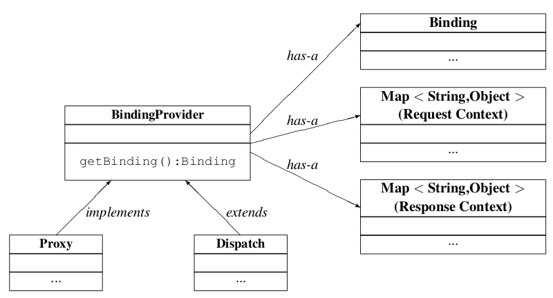

//
// Copyright (c) 2020 Contributors to the Eclipse Foundation
//

[[client-apis]]
== Client APIs

This chapter describes the standard APIs provided for client side use of
Jakarta XML Web Services. These APIs allow a client to create proxies for remote service
endpoints and dynamically construct operation invocations.

Conformance requirements in this chapter use the term 'implementation' to
refer to a client side Jakarta XML Web Services runtime system.

[[serviceapi]]
=== jakarta.xml.ws.Service

`Service` is an abstraction that represents a WSDL service. A WSDL
`service` is a collection of related ports, each of which consists of a
port type bound to a particular protocol and available at a particular
endpoint address.

`Service` instances are created as described in <<svcusage>>.
`Service` instances provide facilities to:

* Create an instance of a proxy via one of the `getPort` methods. See
<<proxies>> for information on proxies.
* Create a `Dispatch` instance via the `createDispatch` method. See
<<dispatch>> for information on the `Dispatch` interface.
* Create a new port via the `addPort` method. Such ports only include
binding and endpoint information and are thus only suitable for creating
`Dispatch` instances since these do not require WSDL port type
information.
* Configure per-service, per-port, and per-protocol message handlers
using a handler resolver (see <<clienthandlerresolver>>).
* Configure the `java.util.concurrent.Executor` to be used for
asynchronous invocations (see <<serviceexecutor>>).

&#9674; _Conformance (Service completeness):_ A `Service` implementation MUST be capable of
creating proxies, `Dispatch` instances, and new ports.

All the service methods except the static `create` methods and the
constructors delegate to `jakarta.xml.ws.spi.ServiceDelegate`, see
<<coresvcdelegate>>.

[[svcusage]]
==== Service Usage

[[dynamiccase]]
===== Dynamic case

In the dynamic case, when nothing is generated, a Java SE service client
uses `Service.create` to create `Service` instances, the following code
illustrates this process.

[source,java,numbered]
-------------
URL wsdlLocation = new URL("http://example.org/my.wsdl");
QName serviceName = new QName("http://example.org/sample", "MyService");
Service s = Service.create(wsdlLocation, serviceName);
-------------

The following `create` methods may be used:

`*create(URL wsdlLocation, QName serviceName)*`::
Returns a service object for the specified WSDL document and service
name.

`*create(QName serviceName)*`::
Returns a service object for a service with the given name. No WSDL
document is attached to the service.

`*create(URL wsdlLocation, QName serviceName, WebServiceFeature ... features)*`::
Returns a service object for the specified WSDL document and service
name. The created service needs to be configured with the web service
features.

`*create(QName serviceName, WebServiceFeature ... features)*`::
Returns a service object for a service with the given name. No WSDL
document is attached to the service. The created service needs to be
configured with the web service features.

&#9674; _Conformance (Service Creation Failure):_ If a `create` method fails to create a
service object, it MUST throw `WebServiceException`. The cause of that
exception SHOULD be set to an exception that provides more information
on the cause of the error (e.g. an `IOException`).

&#9674; _Conformance (Service creation using features):_ The created service object MUST honor
the web service features. If a Jakarta XML Web Services implementation doesn’t understand
any passed-in feature, it MUST throw `WebServiceException`.

[[staticcase]]
===== Static case

When starting from a WSDL document, a concrete service implementation
class MUST be generated as defined in <<gensvcif>>. The generated
implementation class MUST have all the public constructors as shown in
the example below.

When using the constructors, the default WSDL location and service name
are implicitly taken from the `WebServiceClient` annotation that
decorates the generated class.

The following code snippet shows the generated constructors:
[source,java,numbered]
-------------
// Generated Service Class
@WebServiceClient(name="StockQuoteService",
                  targetNamespace="http://example.com/stocks",
                  wsdlLocation="http://example.com/stocks.wsdl")
public class StockQuoteService extends jakarta.xml.ws.Service {
    public StockQuoteService() {
        super(new URL("http://example.com/stocks.wsdl"),
              new QName("http://example.com/stocks", "StockQuoteService"));
    }

    public StockQuoteService(WebServiceFeature ... features) {
        super(new URL("http://example.com/stocks.wsdl"),
              new QName("http://example.com/stocks", "StockQuoteService"),
              features);
    }

    public StockQuoteService(URL wsdlLocation) {
        super(wsdlLocation,
              new QName("http://example.com/stocks", "StockQuoteService"));
    }

    public StockQuoteService(URL wsdlLocation, WebServiceFeature ... features) {
        super(wsdlLocation,
              new QName("http://example.com/stocks", "StockQuoteService"),
              features);
    }

    public StockQuoteService(URL wsdlLocation, QName serviceName) {
        super(wsdlLocation, serviceName);
    }

    public StockQuoteService(URL wsdlLocation, QName serviceName,
                             WebServiceFeature ... features) {
        super(wsdlLocation, serviceName, features);
    }

    ...
}
-------------

[[provider-and-service-delegate]]
==== Provider and Service Delegate

Internally, the `Service` class delegates all of its functionality to a
`ServiceDelegate` object, which is part of the SPI used to allow
pluggability of implementations.

For this to work, every `Service` object internally MUST hold a
reference to a `jakarta.xml.ws.spi.ServiceDelegate` object (see
<<coresvcdelegate>>) to which it delegates every non-static method call.
The field used to hold the reference MUST be private.

The delegate is set when a new `Service` instance is created, which must
necessarily happen when the protected, two-argument constructor defined
on the `Service` class is called. The constructor MUST obtain a Provider
instance (see <<providerendpointcreation>>) and call its
`createServiceDelegate` method, passing the two arguments received from
its caller and the class object for the instance being created (i.e.
`this.getClass()`).

In order to ensure that the delegate is properly constructed, the static
`create` method defined on the `Service` class MUST call the protected
constructor to create a new service instance, passing the same arguments
that it received from the application.

The following code snippet shows an implementation of the `Service` API
that satisfies the requirements above:
[source,java,numbered]
-------------
public class Service {

    private ServiceDelegate delegate;

    protected Service(java.net.URL wsdlDocumentLocation,
                      QName serviceName) {
        delegate = Provider.provider()
                           .createServiceDelegate(wsdlDocumentLocation
                                                  serviceName,
                                                  this.getClass());
    }

    public static Service create(java.net.URL wsdlDocumentLocation,
                                 QName serviceName) {
        return new Service(wsdlDocumentLocation, serviceName);
    }

    // begin delegated methods
    public <T> T getPort(Class<T> serviceEndpointInterface) {
        return delegate.getPort(serviceEndpointInterface);
    }

    ...
}
-------------

[[clienthandlerresolver]]
==== Handler Resolver

Jakarta XML Web Services provides a flexible plug-in framework for message processing
modules, known as handlers, that may be used to extend the capabilities
of a Jakarta XML Web Services runtime system. <<handfmwk>> describes the handler
framework in detail. A `Service` instance provides access to a
`HandlerResolver` via a pair of
`getHandlerResolver`/`setHandlerResolver` methods that may be used to
configure a set of handlers on a per-service, per-port or per-protocol
binding basis.

When a `Service` instance is used to create a proxy or a `Dispatch`
instance then the handler resolver currently registered with the service
is used to create the required handler chain. Subsequent changes to the
handler resolver configured for a `Service` instance do not affect the
handlers on previously created proxies, or `Dispatch` instances.

[[serviceexecutor]]
==== Executor

`Service` instances can be configured with a
`java.util.concurrent.Executor`. The executor will then be used to
invoke any asynchronous callbacks requested by the application. The
`setExecutor` and `getExecutor` methods of `Service` can be used to
modify and retrieve the executor configured for a service.

&#9674; _Conformance (Use of Executor):_ If an executor object is successfully configured for
use by a Service via the `setExecutor` method, then subsequent
asynchronous callbacks MUST be delivered using the specified executor.
Calls that were outstanding at the time the `setExecutor` method was
called MAY use the previously set executor, if any.

&#9674; _Conformance (Default Executor):_ Lacking an application-specified executor, an
implementation MUST use its own executor, a
`java.util.concurrent.ThreadPoolExecutor` or analogous mechanism, to
deliver callbacks. An implementation MUST NOT use application-provided
threads to deliver callbacks, e.g. by "borrowing" them when the
application invokes a remote operation.

[[bindingproviderif]]
=== jakarta.xml.ws.BindingProvider

The `BindingProvider` interface represents a component that provides a
protocol binding for use by clients, it is implemented by proxies and is
extended by the `Dispatch` interface. <<bprovclsrel>>
illustrates the class relationships.

[[bprovclsrel]]
.Binding Provider Class Relationships

A web service client can get an `jakarta.xml.ws.EndpointReference` from a
`BindingProvider` instance that will reference the target endpoint.

&#9674; __Conformance (__``__jakarta.xml.ws.BindingProvider.getEndpointReference__``__):__
An implementation
MUST be able to return an `jakarta.xml.ws.EndpointReference` for the
target endpoint if a SOAP binding is being used. If the
`BindingProvider` instance has a binding that is either SOAP 1.1/HTTP or
SOAP 1.2/HTTP, then a `W3CEndpointReference` MUST be returned. If the
binding is XML/HTTP an `java.lang.UnsupportedOperationException` MUST be
thrown.

&#9674; __Conformance (__``__BindingProvider__``__’s __``__W3CEndpointReference__``__):__ The returned
`W3CEndpointReference` MUST contain `wsam:ServiceName` and
`wsam:ServiceName[@EndpointName]` as per Addressing 1.0 -
Metadata<<bib27>>. The `wsam:InterfaceName` MAY be present in
the `W3CEndpointReference`. If there is an associated WSDL, then the
WSDL location MUST be referenced using `wsdli:wsdlLocation` in the
`W3CEndpointReference`’s `wsa:Metadata`.

The `BindingProvider` interface provides methods to obtain the `Binding`
and to manipulate the binding providers context. Further details on
`Binding` can be found in <<protocolbinding>>. The following
subsection describes the function and use of context with
`BindingProvider` instances.

[[bindingproviderconfig]]
==== Configuration

Additional metadata is often required to control information exchanges,
this metadata forms the context of an exchange.

A `BindingProvider` instance maintains separate contexts for the request
and response phases of a message exchange with a service:

Request::
The contents of the request context are used to initialize the message
context (see <<handmsgctxif>>) prior to invoking any handlers
(see <<handfmwk>>) for the outbound message. Each property
within the request context is copied to the message context with a
scope of `HANDLER`.
Response::
The contents of the message context are used to initialize the
response context after invoking any handlers for an inbound message.
The response context is first emptied and then each property in the
message context that has a scope of `APPLICATION` is copied to the
response context.

&#9674; _Conformance (Message context decoupling):_ Modifications to the request context while
previously invoked operations are in-progress MUST NOT affect the
contents of the message context for the previously invoked operations.

The request and response contexts are of type
`java.util.Map<String,Object>` and are obtained using the
`getRequestContext` and `getResponseContext` methods of
`BindingProvider`.

In some cases, data from the context may need to accompany information
exchanges. When this is required, protocol bindings or handlers (see
<<handfmwk>>) are responsible for annotating outbound protocol
data units and extracting metadata from inbound protocol data units.

[NOTE]
.Note
====
_An example of the latter usage: a handler in a SOAP binding might
introduce a header into a SOAP request message to carry metadata from
the request context and might add metadata to the response context from
the contents of a header in a response SOAP message._
====

[[stdbpprops]]
===== Standard Properties

<<bprovprops>> lists a set of standard properties that may be set
on a `BindingProvider` instance and shows which properties are optional
for implementations to support.

[id="bprovprops"]
.Standard BindingProvider properties
[cols=,,,options="header"]
|==================================
|Name |Type |Mandatory |Description
4+|`*jakarta.xml.ws.service.endpoint*`
|.address   |String |Y  |The address of the service endpoint as
a protocol specific URI. The URI
scheme must match the protocol
binding in use.
4+|`*jakarta.xml.ws.security.auth*`
|.username  |String |Y  |Username for HTTP basic
authentication.
|.password  |String |Y  |Password for HTTP basic
authentication.
4+|`*jakarta.xml.ws.session*`
|.maintain  |Boolean    |Y  |Used by a client to indicate whether it
is prepared to participate in a service
endpoint initiated session. The default
value is `false`.
4+|`*jakarta.xml.ws.soap.http.soapaction*`
|.use   |Boolean    |N  |Controls whether the `SOAPAction`
HTTP header is used in SOAP/HTTP
requests. Default value is `false`.
|.uri   |String     |N  |The value of the `SOAPAction` HTTP
header if the `jakarta.xml.ws.soap.http.soapaction.use` property is
set to `true` . Default value is an empty string.
|==================================

&#9674; __Conformance (Required __``__BindingProvider__``__ properties):__
An implementation MUST support
all properties shown as mandatory in <<bprovprops>>.

Note that properties shown as mandatory are not required to be present
in any particular context; however, if present, they must be honored.

&#9674; __Conformance (Optional __``__BindingProvider__``__ properties):__
An implementation MAY support
the properties shown as optional in <<bprovprops>>.

[[additional-properties]]
===== Additional Properties

&#9674; _Conformance (Additional context properties):_
Implementations MAY define additional
implementation specific properties not listed in <<bprovprops>>.
The java.* and javax.* namespaces are reserved for use by Java
specifications.

Implementation specific properties are discouraged as they limit
application portability. Applications and binding handlers can interact
using application specific properties.

[[asynchronous-operations]]
==== Asynchronous Operations

`BindingProvider` instances may provide asynchronous operation
capabilities. When used, asynchronous operation invocations are
decoupled from the `BindingProvider` instance at invocation time such
that the response context is not updated when the operation completes.
Instead a separate response context is made available using the
`Response` interface, see <<wsdl11asyncmethod>> and
<<dispasyncresp>> for further details on the use of asynchronous methods.

&#9674; _Conformance (Asynchronous response context):_ The local response context of a
`BindingProvider` instance MUST NOT be updated on completion of an
asynchronous operation, instead the response context MUST be made
available via a `Response` instance.

When using callback-based asynchronous operations, an implementation
MUST use the `Executor` set on the service instance that was used to
create the proxy or `Dispatch` instance being used. See
<<serviceexecutor>> for more information on configuring the `Executor` to
be used.

[[proxies]]
==== Proxies

Proxies provide access to service endpoint interfaces at runtime without
requiring static generation of a stub class. See
`java.lang.reflect.Proxy` for more information on dynamic proxies as
supported by the JDK.
Proxy instances are not guaranteed to be thread safe. If the instances
are accessed by multiple threads, usual synchronization techniques can
be used to support multiple threads.

&#9674; _Conformance (Proxy support):_ An implementation MUST support proxies.

&#9674; __Conformance (Implementing __``__BindingProvider__``__):__
An instance of a proxy MUST implement `jakarta.xml.ws.BindingProvider`.

A proxy is created using the `getPort` methods of a `Service` instance:

`*T getPort(Class<T> sei)*`::
Returns a proxy for the specified SEI, the `Service` instance is
responsible for selecting the port (protocol binding and endpoint
address).
`*T getPort(QName port, Class<T> sei)*`::
Returns a proxy for the endpoint specified by `port`. Note that the
namespace component of `port` is the target namespace of the WSDL
definitions document.

`*T getPort(Class<T> sei, WebServiceFeature... features)*`::
Returns a proxy for the specified SEI, the `Service` instance is
responsible for selecting the port (protocol binding and and endpoint
address). The specified `features` MUST be enabled/disabled and
configured as specified.
`*T getPort(QName port, Class<T> sei, WebServiceFeature... features)*`::
Returns a proxy for the endpoint specified by `port`. Note that the
namespace component of port is the target namespace of the WSDL
definition document. The specified `features` MUST be enabled/disabled
and configured as specified.
`*T getPort(EndpointReference epr, Class<T> sei, WebServiceFeature... features)*`::
Returns a proxy for the endpoint specified by `epr`. The address
stored in the `epr` MUST be used during invocations on the endpoint.
The `epr` MUST NOT be used as the value of any addressing header such
as `wsa:ReplyTo`. The specified `features` MUST be enabled/disabled
and configured as specified. Any Jakarta XML Web Services supported `epr` metadata MUST
match the `Service` instance’s ServiceName, otherwise a
`WebServiceExeption` MUST be thrown. Any Jakarta XML Web Services supported `epr`
metadata MUST match the PortName for the `sei`, otherwise a
`WebServiceException` MUST be thrown. If the `Service` instance has an
associated WSDL, its WSDL MUST be used to determine any binding
information, any WSDL in a Jakarta XML Web Services suppported `epr` metadata MUST be
ignored. If the `Service` instance does not have a WSDL, then any WSDL
inlined in the Jakarta XML Web Services supported metadata of the `epr` MUST be used to
determine binding information. If there is not enough metadata in the
`Service` instance or in the `epr` metadata to determine a port, then
a `WebServiceException` MUST be thrown.

The `serviceEndpointInterface` parameter specifies the interface that
will be implemented by the proxy. The service endpoint interface
provided by the client needs to conform to the WSDL to Java mapping
rules specified in <<wsdl112java>>. Creation of a proxy
can fail if the interface doesn’t conform to the mapping or if any WSDL
related metadata is missing from the `Service` instance.

&#9674; __Conformance (__``__Service.getPort__``__ failure):__
If creation of a proxy fails, an
implementation MUST throw `jakarta.xml.ws.WebServiceException`. The cause
of that exception SHOULD be set to an exception that provides more
information on the cause of the error (e.g. an `IOException`).

The use of WS-Addressing requirements can be indicated in a WSDL as per
Addressing 1.0 - Metadata<<bib27>>. A proxy created using
`getPort()` calls is configured with the addressing requirements as
specified in the associated WSDL or explicitly passing
`jakarta.xml.ws.soap.AddressingFeature` web service feature.

&#9674; _Conformance (Proxy’s Addressing use):_ A proxy MUST be configured with the use of
addressing requirements as indicated in the associated WSDL. But if the
proxy is created using `jakarta.xml.ws.soap.AddressingFeature` web service
feature, the feature’s addressing requirements MUST take precedence over
WSDL’s addressing requirements.

An implementation is not required to fully validate the service endpoint
interface provided by the client against the corresponding WSDL
definitions and may choose to implement any validation it does require
in an implementation specific manner (e.g., lazy and eager validation
are both acceptable).

[[example-3]]
===== Example

The following example shows the use of a proxy to invoke a method
(`getLastTradePrice`) on a service endpoint interface
(`com.example.StockQuoteProvider`). Note that no statically generated
stub class is involved.

[source,java,numbered]
-------------
jakarta.xml.ws.Service service = ...;
com.example.StockQuoteProvider proxy = service.getPort(portName,
    com.example.StockQuoteProvider.class)
jakarta.xml.ws.BindingProvider bp = (jakarta.xml.ws.BindingProvider) proxy;
Map<String,Object> context = bp.getRequestContext();
context.setProperty("jakarta.xml.ws.session.maintain", Boolean.TRUE);
proxy.getLastTradePrice("ACME");
-------------

Lines 1–3 show how the proxy is created. Lines 4–6 perform some
configuration of the proxy. Lines 7 invokes a method on the proxy.

[[stubexceptions]]
==== Exceptions

All methods of an SEI can throw `jakarta.xml.ws.WebServiceException` and
zero or more service specific exceptions.

&#9674; _Conformance (Remote Exceptions):_ If an error occurs during a remote operation
invocation, an implemention MUST throw a service specific exception if
possible. If the error cannot be mapped to a service specific exception,
an implementation MUST throw a `ProtocolException` or one of its
subclasses, as appropriate for the binding in use. See
<<protocolspecificfaults>> for more details.

&#9674; _Conformance (Exceptions During Handler Processing):_ Exceptions thrown during handler
processing on the client MUST be passed on to the application. If the
exception in question is a subclass of `WebServiceException` then an
implementation MUST rethrow it as-is, without any additional wrapping,
otherwise it MUST throw a `WebServiceException` whose cause is set to
the exception that was thrown during handler processing.

&#9674; _Conformance (Other Exceptions):_ For all other errors, i.e. all those that don’t occur
as part of a remote invocation or handler processing, an implementation
MUST throw a `WebServiceException` whose cause is the original local
exception that was thrown, if any.

For instance, an error in the configuration of a proxy instance may
result in a `WebServiceException` whose cause is a
`java.lang.IllegalArgumentException` thrown by some implementation code.

[[dispatch]]
=== jakarta.xml.ws.Dispatch

XML Web Services use XML messages for communication between services and
service clients. The higher level Jakarta XML Web Services APIs are designed to hide the
details of converting between Java method invocations and the
corresponding XML messages, but in some cases operating at the XML
message level is desirable. The `Dispatch` interface provides support
for this mode of interaction.

&#9674; __Conformance (__``__Dispatch__``__ support):__
Implementations MUST support the
`jakarta.xml.ws.Dispatch` interface.

`Dispatch` supports two usage modes, identified by the constants
`jakarta.xml.ws.Service.Mode.MESSAGE` and
`jakarta.xml.ws.Service.Mode.PAYLOAD` respectively:

Message::
In this mode, client applications work directly with protocol-specific
message structures. E.g., when used with a SOAP protocol binding, a
client application would work directly with a SOAP message.
Message Payload::
In this mode, client applications work with the payload of messages
rather than the messages themselves. E.g., when used with a SOAP
protocol binding, a client application would work with the contents of
the SOAP `Body` rather than the SOAP message as a whole.

`Dispatch` is a low level API that requires clients to construct
messages or message payloads as XML and requires an intimate knowledge
of the desired message or payload structure. `Dispatch` is a generic
class that supports input and output of messages or message payloads of
any type. Implementations are required to support the following types of
object:

`*javax.xml.transform.Source*`::
Use of `Source` objects allows clients to use XML generating and
consuming APIs directly. `Source` objects may be used with any
protocol binding in either message or message payload mode. When used
with the HTTP binding (see <<xmlbindchap>>) in payload mode, the
HTTP request and response entity bodies must contain XML directly or a
MIME wrapper with an XML root part. A `null` value for `Source` is
allowed to make it possible to invoke an HTTP GET method in the HTTP
Binding case. A `WebServiceException` MUST be thrown when a
`Dispatch<Source>` is invoked and the Service returns a MIME message.
When used in message mode, if the message is not an XML message a
`WebServiceException` MUST be thrown.
Jakarta XML Binding Objects::
Use of Jakarta XML Binding allows clients to use Jakarta XML Binding objects generated from an XML
Schema to create and manipulate XML representations and to use these
objects with Jakarta XML Web Services without requiring an intermediate XML
serialization. Jakarta XML Binding objects may be used with any protocol binding in
either message or message payload mode. When used with the HTTP
binding (see <<xmlbindchap>>) in payload mode, the HTTP request
and response entity bodies must contain XML directly or a MIME wrapper
with an XML root part. When used in mssage mode, if the message is not
an XML message a `WebServiceException` MUST be thrown.
`*jakarta.xml.soap.SOAPMessage*`::
Use of `SOAPMessage` objects allows clients to work with SOAP messages
using the convenience features provided by the `jakarta.xml.soap`
package. `SOAPMessage` objects may only be used with `Dispatch`
instances that use the SOAP binding (see <<soapbindchap>>) in
message mode.
`*jakarta.activation.DataSource*`::
Use of `DataSource` objects allows clients to work with MIME-typed
messages. `DataSource` objects may only be used with `Dispatch`
instances that use the HTTP binding (see <<xmlbindchap>>) in
message mode.

A Jakarta XML Web Services implementation MUST honor all `WebServiceFeatures`
(<<webservicefeature>>) for `Dispatch` based applications.

[[dispatchconfig]]
==== Configuration

`Dispatch` instances are obtained using the `createDispatch` factory
methods of a `Service` instance. The `mode` parameter of
`createDispatch` controls whether the new `Dispatch` instance is message
or message payload oriented. The `type` parameter controls the type of
object used for messages or message payloads. `Dispatch` instances are
not thread safe.

`Dispatch` instances are not required to be dynamically configurable for
different protocol bindings; the WSDL binding from which the `Dispatch`
instance is generated contains static information including the protocol
binding and service endpoint address. However, a `Dispatch` instance may
support configuration of certain aspects of its operation and provides
methods (inherited from `BindingProvider`) to dynamically query and
change the values of properties in its request and response contexts –
see <<stdbpprops>> for a list of standard properties.

[[operation-invocation]]
==== Operation Invocation

A `Dispatch` instance supports three invocation modes:

Synchronous request response (`*invoke*` methods)::
The method blocks until the remote operation completes and the results
are returned.
Asynchronous request response (`*invokeAsync*` methods)::
The method returns immediately, any results are provided either
through a callback or via a polling object.
One-way (`*invokeOneWay*` methods)::
The method is logically non-blocking, subject to the capabilities of
the underlying protocol, no results are returned.

Calling `invoke` on the different `Dispatch` types defined above with a
`null` value means an empty message will be sent where allowed by the
binding, message mode and the MEP. So for example when using -

* SOAP 1.1 / HTTP binding in payload mode using `null` will send a soap
message with an empty body.
* SOAP 1.1 / HTTP binding in message mode `null` being passed to
`invoke` is an error condition and will result in a
`WebServiceException`.
* XML / HTTP binding both in payload and in message mode `null` being
passed to `invoke` with the HTTP POST and PUT operations is an error
condition and will result in a `WebServiceException`.

&#9674; __Conformance (Failed __``__Dispatch.invoke__``__):__
When an operation is invoked using an
`invoke` method, an implementation MUST throw a `WebServiceException` if
there is any error in the configuration of the `Dispatch` instance or a
`ProtocolException` if an error occurs during the remote operation
invocation.

&#9674; __Conformance (Failed __``__Dispatch.invokeAsync__``__):__
When an operation is invoked using an
`invokeAsync` method, an implementation MUST throw a
`WebServiceException` if there is any error in the configuration of the
`Dispatch` instance. Errors that occur during the invocation are
reported when the client attempts to retrieve the results of the
operation.

&#9674; __Conformance (Failed __``__Dispatch.invokeOneWay__``__):__
When an operation is invoked using an
`invokeOneWay` method, an implementation MUST throw a
`WebServiceException` if there is any error in the configuration of the
`Dispatch` instance or if an error is detectedfootnote:[The invocation
is logically non-blocking so detection of errors during operation
invocation is dependent on the underlying protocol in use. For SOAP/HTTP
it is possible that certain HTTP level errors may be detected.] during
the remote operation invocation.

See <<soapbindhttp>> for additional SOAP/HTTP requirements.

[[dispasyncresp]]
==== Asynchronous Response

`Dispatch` supports two forms of asynchronous invocation:

Polling::
The `invokeAsync` method returns a `Response` (see below) that may be
polled using the methods inherited from `Future<T>` to determine when
the operation has completed and to retrieve the results.
Callback::
The client supplies an `AsyncHandler` (see below) and the runtime
calls the `handleResponse` method when the results of the operation
are available. The `invokeAsync` method returns a wildcard `Future`
(`Future<?>`) that may be polled to determine when the operation has
completed. The object returned from `Future<?>.get()` has no standard
type. Client code should not attempt to cast the object to any
particular type as this will result in non-portable behavior.

In both cases, errors that occur during the invocation are reported via
an exception when the client attempts to retrieve the results of the
operation.

&#9674; _Conformance (Reporting asynchronous errors):_ If the operation invocation fails, an
implementation MUST throw a `java.util.concurrent.ExecutionException`
from the `Response.get` method.

The cause of an `ExecutionException` is the original exception raised.
In the case of a `Response` instance this can only be a
`WebServiceException` or one of its subclasses.

The following interfaces are used to obtain the results of an operation
invocation:

`*jakarta.xml.ws.Response*`::
A generic interface that is used to group the results of an invocation
with the response context. `Response` extends
`java.util.concurrent.Future<T>` to provide asynchronous result
polling capabilities.
`*jakarta.xml.ws.AsyncHandler*`::
A generic interface that clients implement to receive results in an
asynchronous callback. It defines a single `handleResponse` method
that has a `Response` object as its argument.

[[using-jaxb]]
==== Using Jakarta XML Binding

`Service` provides a `createDispatch` factory method for creating
`Dispatch` instances that contain an embedded `JAXBContext`. The
`context` parameter contains the `JAXBContext` instance that the created
`Dispatch` instance will use to marshall and unmarshall messages or
message payloads.

&#9674; _Conformance (Marshalling failure):_ If an error occurs when using the supplied
`JAXBContext` to marshall a request or unmarshall a response, an
implementation MUST throw a `WebServiceException` whose `cause` is set
to the original `JAXBException`.

[[examples]]
==== Examples

The following examples demonstrate use of `Dispatch` methods in the
synchronous, asynchronous polling, and asynchronous callback modes. For
ease of reading, error handling has been omitted.

[[synchronous-payload-oriented]]
===== Synchronous, Payload-Oriented

[source,java,numbered]
-------------
Source reqMsg = ...;
Service service = ...;
Dispatch<Source> disp = service.createDispatch(portName,
    Source.class, PAYLOAD);
Source resMsg = disp.invoke(reqMsg);
-------------

[[synchronous-message-oriented]]
===== Synchronous, Message-Oriented

[source,java,numbered]
-------------
SOAPMessage soapReqMsg = ...;
Service service = ...;
Dispatch<SOAPMessage> disp = service.createDispatch(portName,
    SOAPMessage.class, MESSAGE);
SOAPMessage soapResMsg = disp.invoke(soapReqMsg);
-------------

[[synchronous-payload-oriented-with-jaxb-objects]]
===== Synchronous, Payload-Oriented With Jakarta XML Binding Objects

[source,java,numbered]
-------------
JAXBContext jc = JAXBContext.newInstance("primer.po");
Unmarshaller u = jc.createUnmarshaller();
PurchaseOrder po = (PurchaseOrder) u.unmarshal(
    new FileInputStream("po.xml"));
Service service = ...;
Dispatch<Object> disp = service.createDispatch(portName, jc, PAYLOAD);
OrderConfirmation conf = (OrderConfirmation) disp.invoke(po);
-------------
In the above example `PurchaseOrder` and `OrderConfirmation` are
interfaces pre-generated by Jakarta XML Binding from the schema document 'primer.po'.

[[asynchronous-polling-message-oriented]]
===== Asynchronous, Polling, Message-Oriented

[source,java,numbered]
-------------
SOAPMessage soapReqMsg = ...;
Service service = ...;
Dispatch<SOAPMessage> disp = service.createDispatch(portName,
    SOAPMessage.class, MESSAGE);
Response<SOAPMessage> res = disp.invokeAsync(soapReqMsg);
while (!res.isDone()) {
    // do something while we wait
}
SOAPMessage soapResMsg = res.get();
-------------

[[asynchronous-callback-payload-oriented]]
===== Asynchronous, Callback, Payload-Oriented

[source,java,numbered]
-------------
class MyHandler implements AsyncHandler<Source> {
    ...
    public void handleResponse(Response<Source> res) {
        Source resMsg = res.get();
        // do something with the results
    }
}

Source reqMsg = ...;
Service service = ...;
Dispatch<Source> disp = service.createDispatch(portName,
    Source.class, PAYLOAD);
MyHandler handler = new MyHandler();
disp.invokeAsync(reqMsg, handler);
-------------

[[catalogfacility]]
=== Catalog Facility

Jakarta XML Web Services mandates support for a standard catalog facility to be used when
resolving any Web service document that is part of the description of a
Web service, specifically WSDL and XML Schema documents.

The facility in question is the OASIS XML Catalogs 1.1 specification
<<bib34>>. It defines an entity catalog that handles the following
two cases:

* Mapping an external entity’s public identifier and/or system
identifier to a URI reference.
* Mapping the URI reference of a resource to another URI reference.

Using the entity catalog, an application can package one or more
description and/or schema documents in jar files, avoiding costly remote
accesses, or remap remote URIs to other, possibly local ones. Since the
catalog is an XML document, a deployer can easily alter it to suit the
local environment, unbeknownst to the application code.

The catalog is assembled by taking into account all accessible resources
whose name is `META-INF/jax-ws-catalog.xml`. Each resource MUST be a
valid entity catalog according to the XML Catalogs 1.1 specification.
When running on the Java SE platform, the current context class loader
MUST be used to retrieve all the resources with the specified name.
Relative URIs inside a catalog file are relative to the location of the
catalog that contains them.

&#9674; _Conformance (Use of the Catalog):_ In the process of resolving a URI that points to a
WSDL document or any document reachable from it, a Jakarta XML Web Services implementation
MUST perform a URI resolution for it, as prescribed by the XML Catalogs
1.1 specification, using the catalog defined above as its entity
catalog.

In particular, every Jakarta XML Web Services API argument or annotation element whose
semantics is that of a WSDL location URI MUST undergo URI resolution
using the catalog facility described in this section.

Although defined in the client API chapter for reasons of ease of
exposure, use of the catalog is in no way restricted to client uses of
WSDL location URIs. In particular, resolutions of URIs to WSDL and
schema documents that arise during the publishing of the contract for an
endpoint (see <<endpointcontract>>) are subject to the requirements in
this section, resulting in catalog-based URI resolutions.

[[endpointreference]]
=== jakarta.xml.ws.EndpointReference

A `jakarta.xml.ws.EndpointReference` is an abstraction that represents an
invocable web service endpoint. Client applications can use an
`EndpointReference` to get a port for an SEI although doing so prevents
them from getting/setting the `Executor` or `HandlerResolver` which
would normally be done on a `Service` instance. The `EndpointReference`
class delegates to the `jakarta.xml.ws.spi.Provider` to perform the
`getPort` operation. The following method can be used to get a proxy for
a Port.

`*getPort(Class<T> serviceEndpointInterface, WebServiceFeature... features)*`::
Gets a proxy for the `serviceEndpointInterface` that can be used to
invoke operations on the endpoint referred to by the
`EndpointReference` instance. The specified `features` MUST be
enabled/disabled and configured as specified. The returned proxy MUST
use the `EndpointReference` instance to determine the endpoint address
and any reference parameters to be sent on endpoint invocations. The
`EndpointReference` instance MUST NOT be used directly as the value of
an WS-Addressing header such as `wsa:ReplyTo`. For this method to
successfully return a proxy, WSDL metadata MUST be available and the
`EndpointReference` instance MUST contain an implementation understood
`ServiceName` in its metadata.
