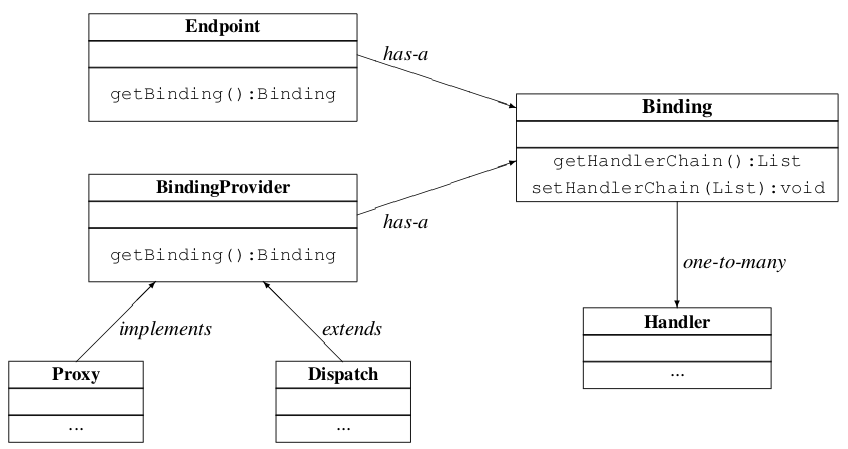
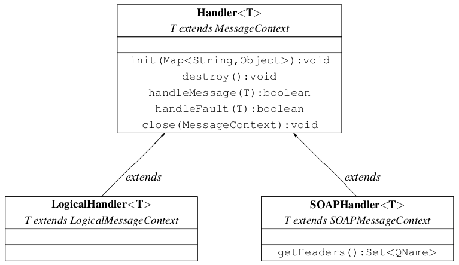
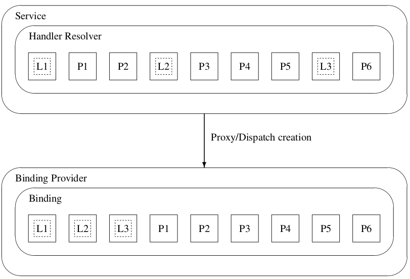

//
// Copyright (c) 2020 Contributors to the Eclipse Foundation
//

[[handfmwk]]
== Handler Framework

Jakarta XML Web Services provides a flexible plug-in framework for message processing
modules, known as handlers, that may be used to extend the capabilities
of a Jakarta XML Web Services runtime system. This chapter describes the handler framework
in detail.

&#9674; _Conformance (Handler framework support):_ An implementation MUST support the handler
framework.

[[architecture]]
=== Architecture

The handler framework is implemented by a Jakarta XML Web Services protocol binding in
both client and server side runtimes. Proxies, and `Dispatch` instances,
known collectively as binding providers, each use protocol bindings to
bind their abstract functionality to specific protocols (see
<<handarchfig>>). Protocol bindings can extend the handler framework to
provide protocol specific functionality; <<soapbindchap>>
describes the Jakarta XML Web Services SOAP binding that extends the handler framework
with SOAP specific functionality.

Client and server-side handlers are organized into an ordered list known
as a handler chain. The handlers within a handler chain are invoked each
time a message is sent or received. Inbound messages are processed by
handlers prior to binding provider processing. Outbound messages are
processed by handlers after any binding provider processing.

Handlers are invoked with a message context that provides methods to
access and modify inbound and outbound messages and to manage a set of
properties. Message context properties may be used to facilitate
communication between individual handlers and between handlers and
client and service implementations. Different types of handlers are
invoked with different types of message context.

[[handarchfig]]
.Handler architecture

[[handlertypes]]
==== Types of Handler

Jakarta XML Web Services defines two types of handler:

Logical::
Handlers that only operate on message context properties and message
payloads. Logical handlers are protocol agnostic and are unable to
affect protocol specific parts of a message. Logical handlers are
handlers that implement `jakarta.xml.ws.handler.LogicalHandler`.
Protocol::
Handlers that operate on message context properties and protocol
specific messages. Protocol handlers are specific to a particular
protocol and may access and change protocol specific aspects of a
message. Protocol handlers are handlers that implement any interface
derived from `jakarta.xml.ws.handler.Handler` except
`jakarta.xml.ws.handler.LogicalHandler`.

Figure <<handclshie>> shows the class hierarchy for handlers.

Handlers for protocols other than SOAP are expected to implement a
protocol-specific interface that extends `jakarta.xml.ws.handler.Handler`.

[[handclshie]]
.Handler class hierarchy

[[binding-responsibilities]]
==== Binding Responsibilities

The following subsections describe the responsibilities of the protocol
binding when hosting a handler chain.

[[handler-and-message-context-management]]
===== Handler and Message Context Management

The binding is responsible for instantiation, invocation, and
destruction of handlers according to the rules specified in section
<<handprocmodel>>. The binding is responsible for instantiation and
management of message contexts according to the rules specified in
<<handmsgctxmngmt>>

&#9674; _Conformance (Logical handler support):_ All binding implementations MUST support
logical handlers (see <<handlertypes>>) being deployed in their
handler chains.

&#9674; _Conformance (Other handler support):_ Binding implementations MAY support other
handler types (see <<handlertypes>>) being deployed in their
handler chains.

&#9674; _Conformance (Incompatible handlers):_ An implementation MUST throw
`WebServiceException` when, at the time a binding provider is created,
the handler chain returned by the configured `HandlerResolver` contains
an incompatible handler.

&#9674; _Conformance (Incompatible handlers):_ Implementations MUST throw a
`WebServiceException` when attempting to configure an incompatible
handler using the `Binding.setHandlerChain` method.

[[handmsgdispatch]]
===== Message Dispatch

The binding is responsible for dispatch of both outbound and inbound
messages after handler processing. Outbound messages are dispatched
using whatever means the protocol binding uses for communication.
Inbound messages are dispatched to the binding provider. Jakarta XML Web Services defines
no standard interface between binding providers and their binding.

[[handexcepthandling]]
===== Exception Handling

The binding is responsible for catching runtime exceptions thrown by
handlers and respecting any resulting message direction and message type
change as described in <<handlerexecution>>.

Outbound exceptionsfootnote:[Outbound exceptions are exceptions thrown
by a handler that result in the message direction being set to outbound
according to the rules in <<handlerexecution>>.] are converted to
protocol fault messages and dispatched using whatever means the protocol
binding uses for communication. Specific protocol bindings describe the
mechanism for their particular protocol, <<soap11excepthandling>>
describes the mechanism for the SOAP 1.1 binding. Inbound exceptions are
passed to the binding provider.

[[handlerconfig]]
=== Configuration

Handler chains may be configured either programmatically or using
deployment metadata. The following subsections describe each form of
configuration.

[[handfmwrkprogconf]]
==== Programmatic Configuration

Jakarta XML Web Services only defines APIs for programmatic configuration of client side
handler chains – server side handler chains are expected to be
configured using deployment metadata.

[[handlerresolver]]
===== jakarta.xml.ws.handler.HandlerResolver

A `Service` instance maintains a handler resolver that is used when
creating proxies or `Dispatch` instances, known collectively as binding
providers. During the creation of a binding provider, the handler
resolver currently registered with a service is used to create a handler
chain, which in turn is then used to configure the binding provider. A
`Service` instance provides access to a `handlerResolver` property, via
the `Service.getHandlerResolver` and `Service.setHandlerResolver`
methods. A `HandlerResolver` implements a single method,
`getHandlerChain`, which has one argument, a `PortInfo` object. The
Jakarta XML Web Services runtime uses the `PortInfo` argument to pass the
`HandlerResolver` of the service, port and binding in use. The
`HandlerResolver` may use any of this information to decide which
handlers to use in constructing the requested handler chain.

When a `Service` instance is used to create an instance of a binding
provider then the created instance is configured with the handler chain
created by the `HandlerResolver` instance registered on the `Service`
instance at that point in time.

&#9674; _Conformance (Handler chain snapshot):_ Changing the handler resolver configured for a
`Service` instance MUST NOT affect the handlers on previously created
proxies, or `Dispatch` instances.

[[handlerordering]]
===== Handler Ordering

The handler chain for a binding is constructed by starting with the
handler chain as returned by the `HandlerResolver` for the service in
use and sorting its elements so that all logical handlers precede all
protocol handlers. In performing this operation, the order of handlers
of any given type (logical or protocol) in the original chain is
maintained. <<handord>> illustrates this.

<<handlerexecution>> describes how the handler order relates to
the order of handler execution for inbound and outbound messages.

[[handord]]
.Handler ordering, Ln and Pn represent logical and protocol handlers respectively.

[[handlerchain]]
===== jakarta.jws.HandlerChain annotation

The `jakarta.jws.HandlerChain` annotation defined by Jakarta XML Web Services
Metadata <<bib16>> may be used to specify in a declarative way the handler
chain to use for a service.

When used in conunction with Jakarta XML Web Services, the `name` element of the
`HandlerChain` annotation, if present, MUST have the default value (the
empty string).

In addition to appearing on a endpoint implementation class or a SEI, as
specified by Jakarta XML Web Services Metadata, the `handlerChain` annotation
MAY appear on a generated service class. In this case, it affects all the proxies
and `Dispatch` instances created using any of the ports on the service.

&#9674; _Conformance (HandlerChain annotation):_ An implementation MUST support using the
`HandlerChain` annotation on an endpoint implementation class, including
a provider, on an endpoint interface and on a generated service class.

On the client, the `HandlerChain` annotation can be seen as a shorthand
way of defining and installing a handler resolver (see
<<clienthandlerresolver>>).

&#9674; _Conformance (Handler resolver for a HandlerChain annotation):_ For a generated service
class (see <<gensvcif>>) which is annotated with a `HandlerChain`
annotation, the default handler resolver MUST return handler chains
consistent with the contents of the handler chain descriptor referenced
by the `HandlerChain` annotation.

Figure <<hchainannex>> shows an endpoint implementation class annotated
with a `HandlerChain` annotation.

[id="hchainannex"]
.Use of the HandlerChain annotation
[source,java,numbered]
-------------
@WebService
@HandlerChain(file="sample_chain.xml")
public class MyService {
    ...
}
-------------

[[jakarta.xml.ws.binding]]
===== jakarta.xml.ws.Binding

The `Binding` interface is an abstraction of a Jakarta XML Web Services protocol binding
(see <<protocolbinding>> for more details). As described above,
the handler chain initially configured on an instance is a snapshot of
the applicable handlers configured on the `Service` instance at the time
of creation. `Binding` provides methods to manipulate the initially
configured handler chain for a specific instance.

&#9674; _Conformance (Binding handler manipulation):_ Changing the handler chain on a `Binding`
instance MUST NOT cause any change to the handler chains configured on
the `Service` instance used to create the `Binding` instance.

[[deployment-model]]
==== Deployment Model

Jakarta XML Web Services defines no standard deployment model for handlers.
Such a model is provided by Jakarta Enterprise Web Services<<bib17>>.

[[handprocmodel]]
=== Processing Model

This section describes the processing model for handlers within the
handler framework.

[[handlerlifecycle]]
==== Handler Lifecycle

In some cases, a Jakarta XML Web Services implementation must instantiate handler classes
directly, e.g. in a container environment or when using the
`HandlerChain` annotation. When doing so, an implementation must invoke
the handler lifecycle methods as prescribed in this section.

If an application does its own instantiation of handlers, e.g. using a
handler resolver, then the burden of calling any handler lifecycle
methods falls on the application itself. This should not be seen as
inconsistent, because handlers are logically part of the application, so
their contract will be known to the application developer.

The Jakarta XML Web Services runtime system manages the lifecycle of handlers by invoking
any methods of the handler class annotated as lifecycle methods before
and after dispatching requests to the handler itself.

The Jakarta XML Web Services runtime system is responsible for loading the handler class
and instantiating the corresponding handler object according to the
instruction contained in the applicable handler configuration file or
deployment descriptor.

The lifecycle of a handler instance begins when the Jakarta XML Web Services runtime
system creates a new instance of the handler class.

The runtime MUST then carry out any injections requested by the handler,
typically via the `jakarta.annotation.Resource` annotation. After all the
injections have been carried out, including in the case where no
injections were requested, the runtime MUST invoke the method carrying a
`jakarta.annotation.PostConstruct` annotation, if present. Such a method
MUST satisfy the requirements in Jakarta Annotations <<bib35>> for lifecycle
methods (i.e. it has a void return type and takes zero arguments). The
handler instance is then ready for use.

&#9674; _Conformance (Handler initialization):_ After injection has been completed, an
implementation MUST call the lifecycle method annotated with
`PostConstruct`, if present, prior to invoking any other method on a
handler instance.

Once the handler instance is created and initialized it is placed into
the `Ready` state. While in the `Ready` state the Jakarta XML Web Services runtime system
may invoke other handler methods as required.

The lifecycle of a handler instance ends when the Jakarta XML Web Services runtime system
stops using the handler for processing inbound or outbound messages.
After taking the handler offline, a Jakarta XML Web Services implementation SHOULD invoke
the lifecycle method which carries a `jakarta.annotation.PreDestroy`
annotation, if present, so as to permit the handler to clean up its
resources. Such a method MUST satisfy the requirements in Jakarta Annotations
<<bib35>> for lifecycle methods

An implementation can only release handlers after the instance they are
attached to, be it a proxy, a `Dispatch` object, an endpoint or some
other component, e.g. a EJB object, is released. Consequently, in
non-container environments, it is impossible to call the `PreDestroy`
method in a reliable way, and handler instance cleanup must be left to
finalizer methods and regular garbage collection.

&#9674; _Conformance (Handler destruction):_ In a managed environment, prior to releasing a
handler instance, an implementation MUST call the lifecycle method
annotated with `PreDestroy` method, if present, on any `Handler`
instances which it instantiated.

The handler instance must release its resources and perform cleanup in
the implementation of the `PreDestroy` lifecycle method. After
invocation of the `PreDestroy` method(s), the handler instance will be
made available for garbage collection.

[[handlerexecution]]
==== Handler Execution

As described in <<handlerordering>>, a set of handlers is managed
by a binding as an ordered list called a handler chain. Unless modified
by the actions of a handler (see below) normal processing involves each
handler in the chain being invoked in turn. Each handler is passed a
message context (see <<handmsgctxmngmt>>) whose contents may be
manipulated by the handler.

For outbound messages handler processing starts with the first handler
in the chain and proceeds in the same order as the handler chain. For
inbound messages the order of processing is reversed: processing starts
with the last handler in the chain and proceeds in the reverse order of
the handler chain. E.g., consider a handler chain that consists of six
handlers __H__~1~...__H__~6~ in that order: for outbound
messages handler __H__~1~ would be invoked first followed by
__H__~2~, __H__~3~, …, and finally handler
__H__~6~; for inbound messages __H__~6~ would be
invoked first followed by __H__~5~, __H__~4~, …,
and finally __H__~1~.

In the following discussion the terms next handler and previous handler
are used. These terms are relative to the direction of the message,
<<Table 9.1>> summarizes their meaning.

Handlers may change the direction of messages and the order of handler
processing by throwing an exception or by returning `false` from
`handleMessage` or `handleFault`. The following subsections describe
each handler method and the changes to handler chain processing they may
cause.

[id="Table 9.1"]
.Next and previous handlers for handler H~i~.
[cols=",,",options="header"]
|==================================
|*Message Direction* |*Term* |*Handler*
.2+|Inbound   |Next |__H__~i-1~
          |Previous |__H__~i+1~
.2+|Outbound  |Next    |__H__~i+1~
          |Previous |__H__~i-1~
|==================================

[[handlemessage]]
===== `handleMessage`

This method is called for normal message processing. Following
completion of its work the `handleMessage` implementation can do one of
the following:

Return `*true*`::
This indicates that normal message processing should continue. The
runtime invokes `handleMessage` on the next handler or dispatches the
message (see <<handmsgdispatch>>) if there are no further
handlers.
Return `*false*`::
This indicates that normal message processing should cease. Subsequent
actions depend on whether the message exchange pattern (MEP) in use
requires a response to the __message currently being
processed__footnote:[For a request-response MEP, if the message
direction is reversed during processing of a request message then the
message becomes a response message. Subsequent handler processing
takes this change into account.] or not:
 +
Response;;
The message direction is reversed, the runtime invokes
`handleMessage` on the nextfootnote:[Next in this context means the
next handler taking into account the message direction reversal]
handler or dispatches the message (see <<handmsgdispatch>>) if
there are no further handlers.
No response;;
Normal message processing stops, `close` is called on each
previously invoked handler in the chain, the message is dispatched
(see <<handmsgdispatch>>).
Throw `*ProtocolException*` or a subclass::
This indicates that normal message processing should cease. Subsequent
actions depend on whether the MEP in use requires a response to the
message currently being processed or not:
 +
Response;;
Normal message processing stops, fault message processing starts.
The message direction is reversed, if the message is not already a
fault message then it is replaced with a fault messagefootnote:[The
handler may have already converted the message to a fault message,
in which case no change is made.], and the runtime invokes
`handleFault` on the nexthandler or dispatches the message (see
<<handmsgdispatch>>) if there are no further handlers.
No response;;
Normal message processing stops, `close` is called on each
previously invoked handler in the chain, the exception is dispatched
(see <<handexcepthandling>>).
Throw any other runtime exception::
This indicates that normal message processing should cease. Subsequent
actions depend on whether the MEP in use includes a response to the
message currently being processed or not:
 +
Response;;
Normal message processing stops, `close` is called on each
previously invoked handler in the chain, the message direction is
reversed, and the exception is dispatched (see section
<<handexcepthandling>>).
No response;;
Normal message processing stops, `close` is called on each
previously invoked handler in the chain, the exception is dispatched
(see <<handexcepthandling>>).

[[handlefault]]
===== `handleFault`

Called for fault message processing, following completion of its work
the `handleFault` implementation can do one of the following:

Return `*true*`::
This indicates that fault message processing should continue. The
runtime invokes `handleFault` on the next handler or dispatches the
fault message (see <<handmsgdispatch>>) if there are no further
handlers.
Return `*false*`::
This indicates that fault message processing should cease. Fault
message processing stops, `close` is called on each previously invoked
handler in the chain, the fault message is dispatched (see section
<<handmsgdispatch>>).
Throw `*ProtocolException*` or a subclass::
This indicates that fault message processing should cease. Fault
message processing stops, `close` is called on each previously invoked
handler in the chain, the exception is dispatched (see section
<<handexcepthandling>>).
Throw any other runtime exception::
This indicates that fault message processing should cease. Fault
message processing stops, `close` is called on each previously invoked
handler in the chain, the exception is dispatched (see section
<<handexcepthandling>>).

[[close]]
===== `close`

A handler’s `close` method is called at the conclusion of a message
exchange pattern (MEP). It is called just prior to the binding
dispatching the final message, fault or exception of the MEP and may be
used to clean up per-MEP resources allocated by a handler. The `close`
method is only called on handlers that were previously invoked via
either `handleMessage` or `handleFault`

&#9674; __Conformance (Invoking __``__close__``__):__
At the conclusion of an MEP, an implementation MUST
call the `close` method of each handler that was previously invoked
during that MEP via either `handleMessage` or `handleFault`.

&#9674; __Conformance (Order of __``__close__``__ invocations):__
Handlers are invoked in the reverse order
in which they were first invoked to handle a message according to the
rules for normal message processing (see <<handlerexecution>>).

[[handler-implementation-considerations]]
==== Handler Implementation Considerations

Handler instances may be pooled by a Jakarta XML Web Services runtime system. All
instances of a specific handler are considered equivalent by a Jakarta XML Web Services
runtime system and any instance may be chosen to handle a particular
message. Different handler instances may be used to handle each message
of an MEP. Different threads may be used for each handler in a handler
chain, for each message in an MEP or any combination of the two.
Handlers should not rely on thread local state to share information.
Handlers should instead use the message context, see section
<<handmsgctxmngmt>>.

[[handmsgctxmngmt]]
=== Message Context

Handlers are invoked with a message context that provides methods to
access and modify inbound and outbound messages and to manage a set of
properties.

Different types of handler are invoked with different types of message
context. <<handmsgctxif>> and <<handlogmsgctx>> describe
`MessageContext` and `LogicalMessageContext` respectively. In addition,
Jakarta XML Web Services bindings may define a message context subtype for their
particular protocol binding that provides access to protocol specific
features. <<soapbindmsgcontext>> describes the message context
subtype for the Jakarta XML Web Services SOAP binding.

[[handmsgctxif]]
==== jakarta.xml.ws.handler.MessageContext

`MessageContext` is the super interface for all Jakarta XML Web Services message contexts.
It extends `Map<String,Object>` with additional methods and constants to
manage a set of properties that enable handlers in a handler chain to
share processing related state. For example, a handler may use the `put`
method to insert a property in the message context that one or more
other handlers in the handler chain may subsequently obtain via the
`get` method.

Properties are scoped as either `APPLICATION` or `HANDLER`. All
properties are available to all handlers for an instance of an MEP on a
particular endpoint. E.g., if a logical handler puts a property in the
message context, that property will also be available to any protocol
handlers in the chain during the execution of an MEP instance.
`APPLICATION` scoped properties are also made available to client
applications (see <<bindingproviderconfig>>) and service endpoint
implementations. The defaultscope for a property is `HANDLER`.

&#9674; _Conformance (Message context property scope):_ Properties in a message context MUST be
shared across all handler invocations for a particular instance of an
MEP on any particular endpoint.

[[stdbindingprops]]
===== Standard Message Context Properties

<<Table 9.2>> lists the set of standard `MessageContext`
properties.

The standard properties form a set of metadata that describes the
context of a particular message. The property values may be manipulated
by client applications, service endpoint implementations, the Jakarta XML Web Services
runtime or handlers deployed in a protocol binding. A Jakarta XML Web Services runtime is
expected to implement support for those properties shown as mandatory
and may implement support for those properties shown as optional.

<<Table 9.3>> lists the standard `MessageContext`
properties specific to the HTTP protocol. These properties are only
required to be present when using an HTTP-based binding.

<<Table 9.4>> lists those properties that are
specific to endpoints running inside a servlet container. These
properties are only required to be present in the message context of an
endpoint that is deployed inside a servlet container and uses an
HTTP-based binding.

[id="Table 9.2"]
.Standard `MessageContext` properties.
[cols=",,,",options="header"]
|==================================
|Name           |Type       |Mandatory  |Description
4+|`*jakarta.xml.ws.handler.message*`
|`.outbound`    |`Boolean`    |Y          |Specifies the message direction: `true` for
outbound messages, `false` for inbound messages.
4+|`*jakarta.xml.ws.binding.attachments*`
|`.inbound` |`Map<String,DataHandler>`    |Y |A
map of attachments to an inbound message. The key is a unique identifier
for the attachment. The value is a `DataHandler` for the attachment
data. Bindings describe how to carry attachments with messages.
|`.outbound`    |`Map<String,DataHandler>` |Y
|A map of attachments to an outbound message. The key is a unique
identifier for the attachment. The value is a `DataHandler` for the
attachment data. Bindings describe how to carry attachments with
messages.
4+|`*jakarta.xml.ws.reference`*
|`.parameters`  |`List<Element>`    |Y  |A list of WS Addressing reference
parameters. The list MUST include all SOAP headers marked with the
`wsa:IsReferenceParameter="true"` attribute.
4+|`*jakarta.xml.ws.wsdl*`
|`.description` |`URI`    |N  |A resolvable URI that may be used to obtain
access to the WSDL for the endpoint.
|`.service`     |`QName`    |N  |The name
of the service being invoked in the WSDL.
|`.port`    |`QName`  |N |The name
of the port over which the current message was received in the WSDL.
|`.interface`   |`QName`  |N  |The name of the port type to which the
current message belongs.
|`.operation`   |`QName`  |N  |The name of the WSDL
operation to which the current message belongs. The namespace is the
target namespace of the WSDL definitions element.
|==================================

[id="Table 9.3"]
.Standard HTTP `MessageContext` properties.
[cols=",,,",options="header"]
|==================================
|Name           |Type       |Mandatory  |Description
4+|`*jakarta.xml.ws.http.request*`
|`.headers`     |`Map<String,List<String>>`
|Y  |A map of the HTTP headers for the request message. The key is the
header name. The value is a list of values for that header.
|`.method`  |`String`   |Y  |The HTTP method for the request message.
|`.querystring` |`String`   |Y  |The HTTP query string for the request message, or `null`
if the request does not have any. If the address specified using the
jakarta.xml.ws.service.endpoint.address in the BindingProvider contains a
query string and if the querystring property is set by the client it
will override the existing query string in the
jakarta.xml.ws.service.endpoint.address property. The value of the
property does not include the leading "?" of the query string in it.
This property is only used with HTTP binding.
|`.pathinfo`    |`String`   |Y  |Extra path information associated with the URL the client sent when it
made this request. The extra path information follows the base url path
but precedes the query string and will start with a "/" character.
4+|*`jakarta.xml.ws.http.response`*
|`.headers` |`Map<String,List<String>>`
|Y  |A map of the HTTP headers for the response message. The key is the
header name. The value is a list of values for that header.
|`.code`    |`Integer`    |Y  |The HTTP response status code.
|==================================

[id="Table 9.4"]
.Standard Servlet Container-Specific `MessageContext` properties.
[cols=",,,",options="header"]
|==================================
|Name           |Type       |Mandatory  |Description
4+|`*jakarta.xml.ws.servlet*`
|`.context` |`jakarta.servlet.ServletContex`t   |Y  |The `ServletContext`
object belonging to the web application that contains the endpoint.
|`.request` |`jakarta.servlet.http.HttpServletRequest`  |Y  |The
`HttpServletRequest` object associated with the request currently being
served.
|`.response`    |`jakarta.servlet.http.HttpServletResponse` |Y  |The
`HttpServletResponse` object associated with the request currently being
served.
|==================================

[[handlogmsgctx]]
==== jakarta.xml.ws.handler.LogicalMessageContext

Logical handlers (see <<handlertypes>>) are passed a message
context of type `LogicalMessageContext` when invoked.
`LogicalMessageContext` extends `MessageContext` with methods to obtain
and modify the message payload, it does not provide access to the
protocol specific aspects of a message. A protocol binding defines what
component of a message are available via a logical message context.
E.g., the SOAP binding, see <<soapbindchaphand>>, defines that a
logical handler deployed in a SOAP binding can access the contents of
the SOAP body but not the SOAP headers whereas the XML/HTTP binding
described in <<xmlbindchap>> defines that a logical handler can
access the entire XML payload of a message.

The `getSource()` method of `LogicalMessageContext` MUST return null
whenever the message doesn’t contain an actual payload. A case in which
this might happen is when, on the server, the endpoint implementation
has thrown an exception and the protocol in use does not define a notion
of payload for faults (e.g. the HTTP binding defined in <<xmlbindchap>>).

[[reltojaxwsctx]]
==== Relationship to Application Contexts

Client side binding providers have methods to access contexts for
outbound and inbound messages. As described in section
<<bindingproviderconfig>> these contexts are used to initialize a message
context at the start of a message exchange and to obtain application
scoped properties from a message context at the end of a message
exchange.

As described in <<serviceapis>>, service endpoint implementations
may require injection of a context from which they can access the
message context for each inbound message and manipulate the
corresponding application-scoped properties.

Handlers may manipulate the values and scope of properties within the
message context as desired. E.g., a handler in a client-side SOAP
binding might introduce a header into a SOAP request message to carry
metadata from a property that originated in a `BindingProvider` request
context; a handler in a server-side SOAP binding might add application
scoped properties to the message context from the contents of a header
in a request SOAP message that is then made available in the context
available (via injection) to a service endpoint implementation.
